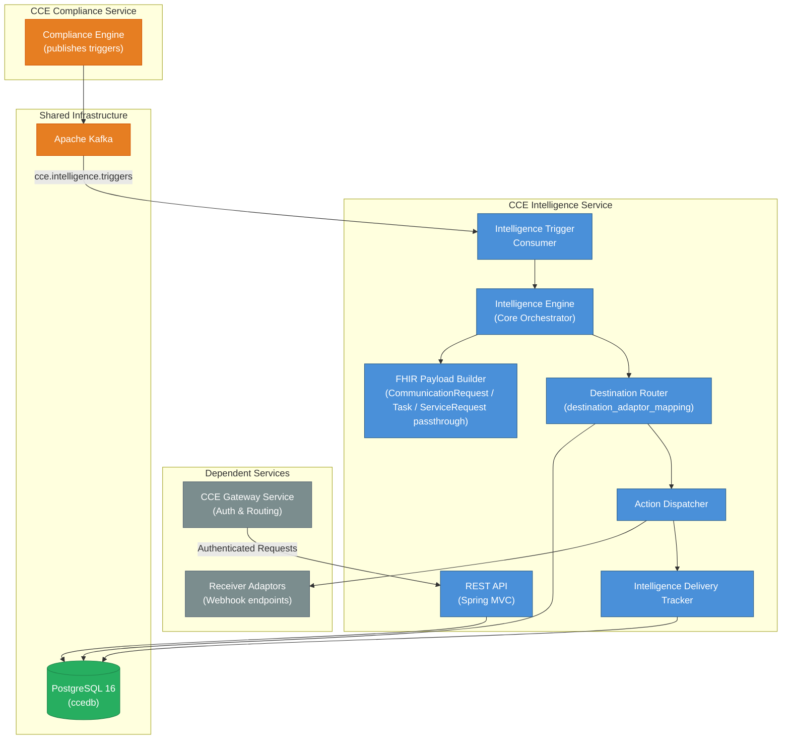
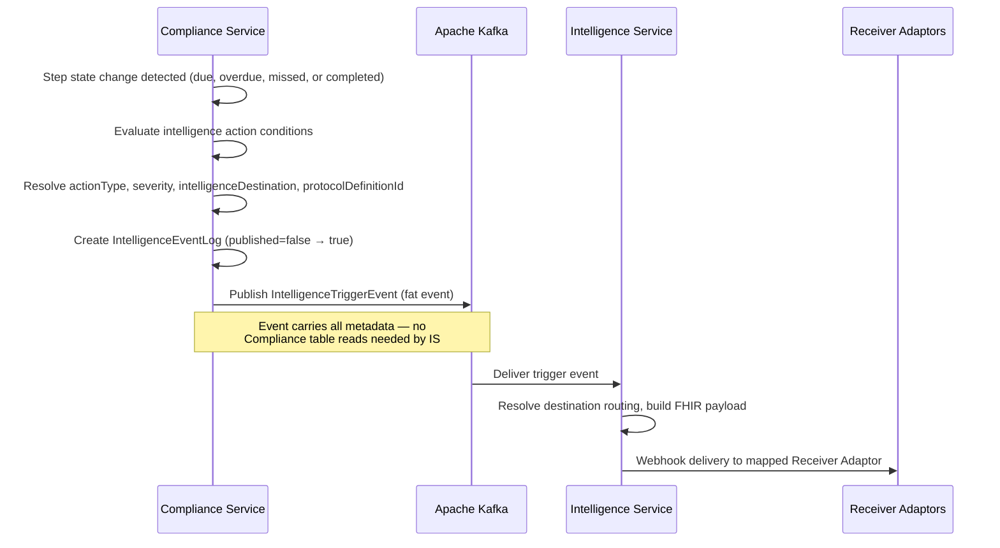
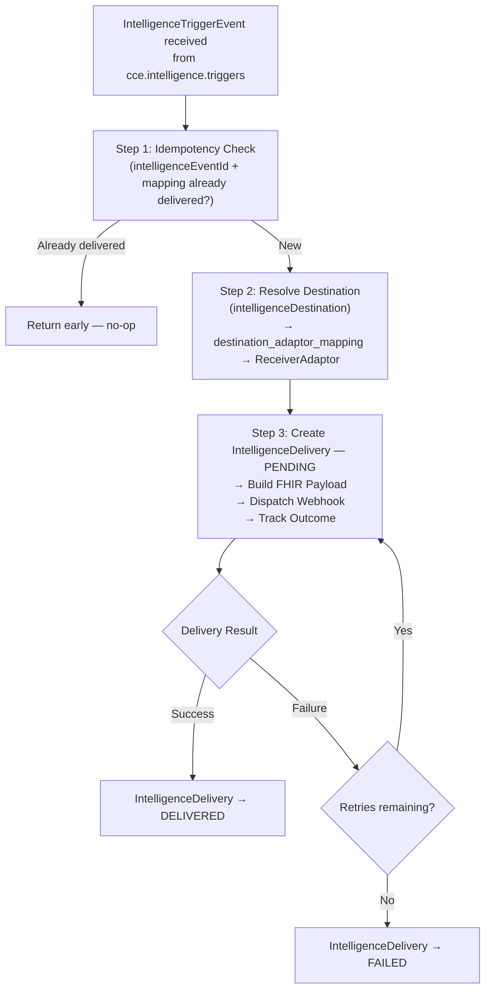
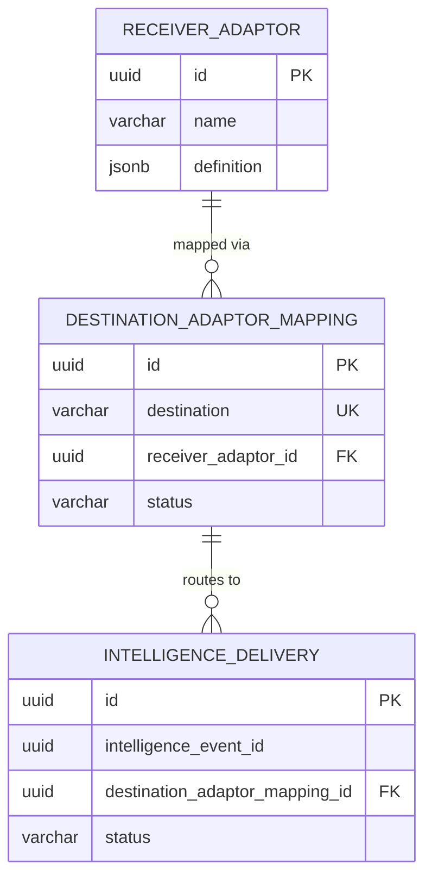
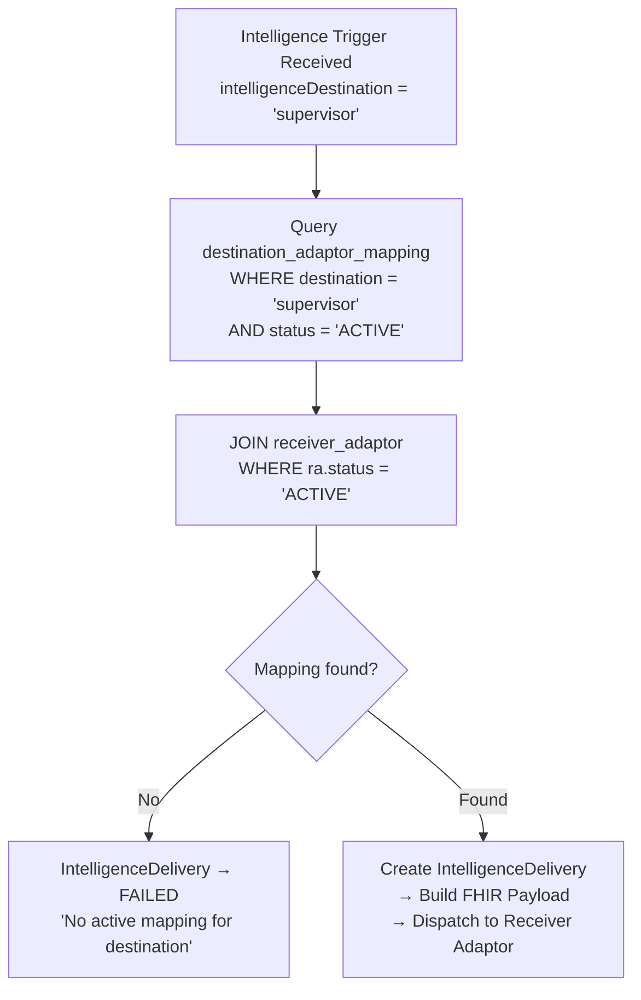
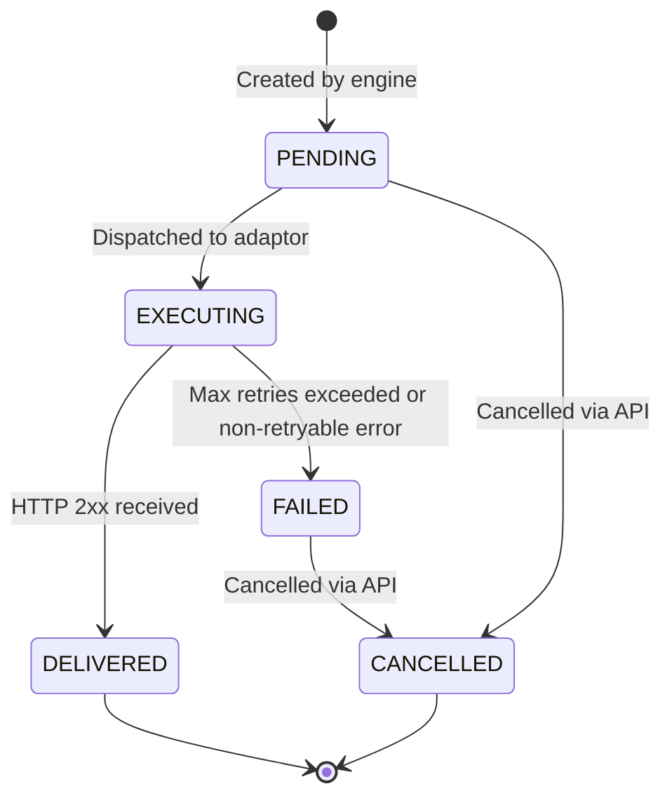

# Architecture & Design

## 1. System Context

The **CCE Intelligence Service** is the delivery engine of the CCE platform. It consumes **self-contained** intelligence trigger events published by the Compliance Service via Kafka, resolves routing via **destination-adaptor mappings**, builds FHIR-compliant payloads, and delivers actions to registered **Receiver Adaptors** via webhook.

> All REST requests arrive via the **CCE Gateway Service**, which validates OAuth tokens and enforces scopes (`intelligence-deliveries:read|write`, `destination-adaptor-mappings:read|write`, `admin`). The Intelligence Service does not handle authentication or authorization.



**This service does NOT handle:** event ingestion (Collector), protocol matching (Compliance), time-based transitions (Scheduler), analytics dashboards (Insights), or authentication/authorization (Gateway).

---

## 1.1 Compliance Service Contract

The **CCE Compliance Service** (release-1.0.0+) is the upstream publisher. When a step's status changes, the Compliance Service's `IntelligenceActionEvaluator` evaluates PlanDefinition intelligence actions, resolves all metadata (action type, severity, intelligence destination, protocol definition), creates `IntelligenceEventLog` records (`published=false` → `true`), and publishes a **self-contained** `IntelligenceTriggerEvent` to `cce.intelligence.triggers`.



#### Ownership Boundaries

| Aspect | Owner | Details |
|---|---|---|
| **Intelligence action evaluation** | Compliance Service | Evaluates PlanDefinition conditions, resolves all metadata, publishes self-contained triggers to Kafka |
| **`action_definition` table** | Compliance Service | FHIR ActivityDefinition resources — **not accessed** by Intelligence Service at runtime |
| **`intelligence_event_log` table** | Compliance Service | Tracks intelligence action execution and evaluation context. `intelligence_event_log.id` maps to `intelligenceEventId` in the trigger event — stored in `intelligence_delivery` for traceability only |
| **Trigger consumption & routing** | Intelligence Service | Consumes self-contained triggers, resolves destination → adaptor mapping, delivers via webhook |
| **`receiver_adaptor` table** | Intelligence Service | Registered webhook endpoints (FHIR Endpoint resource in `definition` column) |
| **`destination_adaptor_mapping` table** | Intelligence Service | 1:1 routing map (destination → adaptor) |
| **`intelligence_delivery` table** | Intelligence Service | Delivery lifecycle per (intelligence_event × adaptor); `intelligence_event_id` stored for traceability (maps to `intelligence_event_log.id`, not a runtime FK) |
| **`intelligence_delivery_audit_log` table** | Intelligence Service | Audit trail for delivery operations |

> **Key invariant:** The Compliance Service evaluates *when* to act, *what* action to take, and publishes a self-contained trigger event with all resolved metadata. The Intelligence Service decides *where* to deliver it (destination-based routing via `destination_adaptor_mapping`) and *how* (FHIR payload + webhook to receiver adaptors). This separation allows routing to evolve independently of clinical logic, and the fat event design eliminates all cross-service runtime dependencies.

---

## 2. Technology Stack

| Concern | Technology | Version |
|---------|------------|---------|
| Language | Java | 21 (LTS) |
| Framework | Spring Boot | 3.4.x |
| Build tool | Gradle | 8.x |
| Database | PostgreSQL | 16+ (shared `ccedb` database) |
| Message broker | Apache Kafka | 3.7+ (KRaft mode) |
| DB access | Spring Data JPA + Hibernate | (Spring Boot managed) |
| DB migration | Flyway | (Spring Boot managed) |
| Connection pool | HikariCP | (Spring Boot default) |
| Expression evaluation | ~~Apache Johnzon JsonLogic~~ | ~~2.0.2~~ | *Removed — evaluation handled by Compliance Service* |
| HTTP client | Spring WebClient (reactive, non-blocking) | (Spring Boot managed) |
| Observability | Micrometer + Prometheus | (Spring Boot managed) |
| Testing | JUnit 5, MockMvc, MockWebServer, H2 | |

### Key Gradle Dependencies

```groovy
// Spring Boot starters
implementation 'org.springframework.boot:spring-boot-starter-web'
implementation 'org.springframework.boot:spring-boot-starter-data-jpa'
implementation 'org.springframework.boot:spring-boot-starter-actuator'
implementation 'org.springframework.boot:spring-boot-starter-validation'
implementation 'org.springframework.boot:spring-boot-starter-webflux'  // WebClient for webhook delivery
implementation 'org.springframework.kafka:spring-kafka'

// Database
runtimeOnly 'org.postgresql:postgresql'
implementation 'org.flywaydb:flyway-core'
implementation 'org.flywaydb:flyway-database-postgresql'

// Expression evaluation — removed (evaluation handled by Compliance Service)
// implementation 'org.apache.johnzon:johnzon-jsonlogic:2.0.2'

// Observability
implementation 'io.micrometer:micrometer-registry-prometheus'

// Testing
testImplementation 'org.springframework.boot:spring-boot-starter-test'
testImplementation 'org.springframework.kafka:spring-kafka-test'
testImplementation 'com.squareup.okhttp3:mockwebserver:4.12.0'  // Mock webhook endpoints
testImplementation 'com.h2database:h2'                         // In-memory DB for integration tests
testImplementation 'org.awaitility:awaitility'                 // Async test assertions
testRuntimeOnly 'org.junit.platform:junit-platform-launcher'
```


---

## 3. Package Structure

```
src/main/java/org/openphc/cce/intelligence/
├── IntelligenceServiceApplication.java           # @SpringBootApplication
├── config/
│   ├── KafkaConsumerConfig.java                   # Consumer factory, error handler, DLQ
│   ├── WebClientConfig.java                       # WebClient for webhook delivery
│   ├── IntelligenceProperties.java                # @ConfigurationProperties for webhook settings
│   ├── AsyncConfig.java                           # @EnableAsync for audit writes
│   └── MetricsConfig.java                         # Custom Gauge metrics (active destinations)
├── domain/
│   ├── entity/
│   │   ├── IntelligenceDelivery.java                       # Delivery lifecycle per (intelligence_event × adaptor)
│   │   ├── ReceiverAdaptor.java                   # Registered webhook endpoint
│   │   ├── DestinationAdaptorMapping.java         # 1:1 routing map (destination → adaptor)
│   │   └── IntelligenceDeliveryAuditLog.java                  # Audit trail entry
│   ├── enums/
│   │   ├── IntelligenceDeliveryStatus.java                 # PENDING, EXECUTING, DELIVERED, FAILED, CANCELLED
│   │   ├── ActionType.java                        # CommunicationRequest, Task, ServiceRequest
│   │   └── IntelligenceSeverity.java              # LOW, MEDIUM, HIGH, CRITICAL
│   └── repository/
│       ├── IntelligenceDeliveryRepository.java
│       ├── ReceiverAdaptorRepository.java
│       ├── DestinationAdaptorMappingRepository.java
│       └── IntelligenceDeliveryAuditLogRepository.java
├── engine/
│   ├── IntelligenceEngine.java                    # Core orchestrator — trigger → build payload → route → deliver
│   ├── FhirPayloadBuilder.java                    # Builds FHIR CommunicationRequest / Task; passes through ServiceRequest payload
│   ├── DestinationRouter.java                     # Resolve destination → ReceiverAdaptor via destination_adaptor_mapping
│   └── ActionDispatcher.java                      # Webhook delivery to mapped adaptor
├── kafka/
│   ├── config/                                    # Consumer factory, topic bindings
│   ├── consumer/
│   │   └── IntelligenceTriggerConsumer.java       # @KafkaListener for cce.intelligence.triggers
│   └── model/
│       └── IntelligenceTriggerEvent.java          # Inbound Kafka message record
├── service/
│   ├── IntelligenceDeliveryService.java                    # Intelligence delivery lifecycle management
│   ├── ReceiverAdaptorService.java                # Adaptor registration and lookup
│   ├── DestinationAdaptorMappingService.java      # Destination mapping management
│   └── IntelligenceDeliveryAuditService.java                  # @Async audit logging
├── webhook/
│   └── WebhookDeliveryClient.java                 # WebClient-based HTTP POST to adaptor endpoint
└── web/
    ├── controller/
    │   ├── IntelligenceDeliveryController.java
    │   ├── ReceiverAdaptorController.java
    │   └── DestinationAdaptorMappingController.java
    ├── dto/
    │   ├── IntelligenceDeliveryDto.java
    │   ├── ReceiverAdaptorDto.java
    │   ├── DestinationAdaptorMappingDto.java
    │   └── DtoMapper.java
    └── GlobalExceptionHandler.java

src/main/resources/
├── application.yml
├── application-docker.yml
└── db/migration/
    └── V1__create_intelligence_tables.sql

src/test/java/org/openphc/cce/intelligence/           # Unit tests
src/integrationTest/java/org/openphc/cce/intelligence/ # Integration tests
```

**Total:** ~44 source files across 10 packages.

---

## 4. Core Pipeline — IntelligenceEngine

The `IntelligenceEngine` is the central orchestrator. The pipeline is deliberately simple — the Compliance Service has already evaluated *when* and *what* to act on, and the trigger event carries all metadata. This service only handles *where* (routing) and *how* (FHIR payload + webhook delivery), with **zero Compliance table reads** on the hot path.



### 4.1 Data Flow: Trigger Event → FHIR Payload

The trigger event is **self-contained** — all fields needed for routing and FHIR payload construction are carried directly in the event. No Compliance table lookups required.

```
IntelligenceTriggerEvent
  ├── actionType ───────────► FHIR kind (CommunicationRequest / Task / ServiceRequest) — stored directly as ActionType
  ├── severity ─────────────► FHIR priority mapping + extension
  ├── intelligenceDestination ► Routing lookup (destination_adaptor_mapping) + FHIR recipient
  ├── subject ──────────────► FHIR subject.identifier
  ├── protocolCanonical ────► FHIR about[0].reference
  ├── actionId ─────────────► FHIR about[1].display
  ├── stepState ────────────► FHIR extension (cce-step-state)
  ├── detectedAt ───────────► FHIR authoredOn
  ├── eventPayload ─────────► If present AND actionType=ServiceRequest → passed through as-is (original FHIR payload from Compliance Service)
  ├── intelligenceEventId ───────► intelligence_delivery.intelligence_event_id (traceability)
  └── actionDefinitionId ──► intelligence_delivery.action_definition_id (traceability)
```

### 4.2 FHIR Payload Generation

The `FhirPayloadBuilder` constructs **FHIR R4-compliant payloads** directly from the trigger event fields. All structured data the receiver needs is in standard FHIR fields and CCE extensions. A default human-readable summary is generated for `payload.contentString` / `description`.

#### ActionType

The trigger event's `actionType` carries the FHIR `ActivityDefinition.kind` value (`CommunicationRequest`, `Task`, `ServiceRequest`). This value is stored directly as the `intelligence_delivery.action_type` — no secondary mapping is applied.

| `actionType` Value | FHIR Payload Resource | Description |
|---|---|---|
| `CommunicationRequest` | `CommunicationRequest` | Alert, reminder, or notification |
| `Task` | `Task` | Cross-system task creation |
| `ServiceRequest` (with `eventPayload`) | **Passthrough** — original `eventPayload` from Compliance Service | Referral or lab order |
| `ServiceRequest` (without `eventPayload`) | `ServiceRequest` (built by FhirPayloadBuilder) | Referral or lab order |

The `actionType` is used in the FHIR payload's `category` / `code` coding, the `contentString` summary, and the REST API response.

#### Payload Resource Types

| Action Type | FHIR Resource | Rationale |
|---|---|---|
| `CommunicationRequest` | `CommunicationRequest` | Standard FHIR resource for "send this message" semantics |
| `Task` | `Task` | Standard FHIR resource for "perform this action" semantics |
| `ServiceRequest` | Passthrough / `ServiceRequest` | When `eventPayload` is present, the original FHIR payload from the Compliance Service is passed through as-is. Otherwise a `ServiceRequest` resource is built by `FhirPayloadBuilder`. |

#### CommunicationRequest Payload

```json
{
  "resourceType": "CommunicationRequest",
  "identifier": [{
    "system": "http://openphc.org/fhir/intelligence-delivery-id",
    "value": "aaaa-bbbb-cccc-dddd"
  }],
  "status": "active",
  "priority": "urgent",
  "category": [{
    "coding": [{
      "system": "http://openphc.org/fhir/CodeSystem/cce-action-type",
      "code": "CommunicationRequest",
      "display": "CommunicationRequest"
    }]
  }],
  "subject": {
    "identifier": { "system": "http://openphc.org/fhir/patient-upid", "value": "260225-0002-5501" }
  },
  "about": [
    { "reference": "PlanDefinition/anc-high-risk|2.1" },
    { "display": "anc-visit-2" }
  ],
  "payload": [{
    "contentString": "[HIGH] CommunicationRequest for patient 260225-0002-5501 — step anc-visit-2 overdue (PlanDefinition/anc-high-risk|2.1)"
  }],
  "recipient": [{ "display": "supervisor" }],
  "authoredOn": "2026-04-15T00:00:05Z",
  "extension": [
    {
      "url": "http://openphc.org/fhir/StructureDefinition/cce-severity",
      "valueCode": "high"
    },
    {
      "url": "http://openphc.org/fhir/StructureDefinition/cce-intelligence-event-id",
      "valueId": "intelligence-event-uuid"
    },
    {
      "url": "http://openphc.org/fhir/StructureDefinition/cce-step-state",
      "valueCode": "overdue"
    }
  ]
}
```

#### Task Payload

```json
{
  "resourceType": "Task",
  "identifier": [{
    "system": "http://openphc.org/fhir/intelligence-delivery-id",
    "value": "aaaa-bbbb-cccc-dddd"
  }],
  "status": "requested",
  "intent": "order",
  "priority": "urgent",
  "code": {
    "coding": [{
      "system": "http://openphc.org/fhir/CodeSystem/cce-action-type",
      "code": "Task",
      "display": "Task"
    }]
  },
  "description": "[CRITICAL] Task for patient 260225-0002-5501 — step anc-visit-2 overdue (PlanDefinition/anc-high-risk|2.1)",
  "for": {
    "identifier": { "system": "http://openphc.org/fhir/patient-upid", "value": "260225-0002-5501" }
  },
  "authoredOn": "2026-04-15T00:00:05Z",
  "extension": [
    {
      "url": "http://openphc.org/fhir/StructureDefinition/cce-severity",
      "valueCode": "critical"
    },
    {
      "url": "http://openphc.org/fhir/StructureDefinition/cce-protocol-canonical",
      "valueCanonical": "PlanDefinition/anc-high-risk|2.1"
    },
    {
      "url": "http://openphc.org/fhir/StructureDefinition/cce-action-id",
      "valueString": "anc-visit-2"
    }
  ]
}
```

#### FHIR Field Mapping

| FHIR Field | CommunicationRequest | Task | Source |
|---|---|---|---|
| `identifier` | Intelligence delivery ID | Intelligence delivery ID | `intelligence_delivery.id` |
| `status` | `active` | `requested` | Fixed per resource type |
| `priority` | Mapped from severity | Mapped from severity | `trigger.severity` |
| `category` / `code` | Action type coding | Action type coding | `trigger.actionType` |
| `subject` / `for` | Patient UPID | Patient UPID | `trigger.subject` |
| `about` | Protocol + action ID | — | `trigger.protocolCanonical`, `trigger.actionId` |
| `payload.contentString` / `description` | Auto-generated summary (includes stepState) | Auto-generated summary (includes stepState) | `FhirPayloadBuilder` |
| `recipient` | Destination name | — | `trigger.intelligenceDestination` |
| `authoredOn` | Detection time | Detection time | `trigger.detectedAt` |
| `extension.*` | Step state | Same | Trigger event fields |

#### Severity → FHIR Priority Mapping

| CCE Severity | FHIR `priority` |
|---|---|
| `LOW` | `routine` |
| `MEDIUM` | `urgent` |
| `HIGH` | `urgent` |
| `CRITICAL` | `asap` |

---

## 5. Destination Routing

### 5.1 One-to-One Routing Model

The Intelligence Service uses a simple **destination-adaptor mapping** model: each intelligence destination maps to exactly one Receiver Adaptor. The `destination` column is unique — ensuring a single, deterministic delivery target per destination name. This eliminates fan-out complexity, wildcard resolution, and deduplication logic.



### 5.2 Routing Flow



### 5.3 Example: Destination-Adaptor Mappings

| Destination | Receiver Adaptor | Purpose |
|---|---|---|
| `supervisor` | CHW Team Lead SMS Gateway | Supervisor escalations delivered via SMS |
| `patient-reminder` | WhatsApp Bot Adaptor | Patient reminders via WhatsApp |
| `lab-coordinator` | Lab Coordinator Dashboard | Lab coordination tasks to dashboard |
| `district-health-office` | District Health Office API | District-level alerts |
| `chw-alert` | Kigali South SMS Gateway | CHW field notifications |

> **Simplicity:** Each destination resolves to exactly one adaptor. The Compliance Service controls *which* destination to target via the `intelligenceDestination` field in the trigger event — different PlanDefinition actions can specify different destinations.

---

## 6. State Machines

### 6.1 Intelligence Delivery



**Status transitions:**

| From | To | Trigger |
|---|---|---|
| `PENDING` | `EXECUTING` | Webhook dispatch initiated |
| `PENDING` | `CANCELLED` | Manual cancellation via REST API |
| `EXECUTING` | `DELIVERED` | HTTP 2xx response from adaptor |
| `EXECUTING` | `FAILED` | Non-retryable error (4xx) or max retries exceeded (5xx/timeout) |
| `FAILED` | `CANCELLED` | Manual cancellation via REST API |

Terminal states: `DELIVERED`, `CANCELLED`.

### 6.2 Idempotency

- **Per-intelligence_event:** `(intelligence_event_id, destination_adaptor_mapping_id)` unique constraint on `intelligence_delivery` prevents duplicate processing for the same intelligence event + adaptor combination.
- **Cross-trigger:** If the Compliance Service publishes duplicate trigger events for the same `intelligence_event_log` record, the Intelligence Service's idempotency guard ensures the adaptor gets exactly one `intelligence_delivery`.
- **Per-destination:** Each destination maps to exactly one adaptor, so each intelligence event produces at most one delivery per destination.

---

## 7. Security

- **Authentication & Authorization:** Handled by the **CCE API Gateway**. This service does not implement security directly — all requests arrive pre-authenticated.
- **Webhook credentials:** Stored in `receiver_adaptor.config` JSONB (separate from the FHIR Endpoint in `definition`). The **external Receiver Adaptor operator** generates and manages their own auth credentials (API keys, bearer tokens, mTLS certs). A CCE admin registers the adaptor via `POST /v1/receiver-adaptors`, placing the operator-provided credentials into `config`. The `WebhookDeliveryClient` reads `authHeader` + `authValue` at dispatch time and injects them into the outbound HTTP request. The Intelligence Service never *issues* tokens — it only *stores and presents* credentials that the receiving system expects.
- **Credential protection:** `authValue` in `receiver_adaptor.config` should be encrypted at rest in production (e.g., via PostgreSQL pgcrypto or application-level encryption). Credentials are **never logged** — the `WebhookDeliveryClient` masks them in all log output. `authValue` is **never returned** in REST API responses — DTOs mask it (e.g., `sk-***123`).
- **Webhook request signing (HMAC):** Each Receiver Adaptor can configure a `webhookSecret` in `config`. When present, the `WebhookDeliveryClient` computes `HMAC-SHA256(webhookSecret, requestBody)` and sends it as the `X-CCE-Signature-256` header. The receiving system verifies the signature to ensure the request is authentically from the CCE platform. This prevents spoofing — critical for healthcare delivery endpoints.
- Actuator endpoints are publicly accessible for health checks and monitoring.

---

## 8. Observability

### 8.1 Metrics

| Metric | Type | Tags | Description |
|---|---|---|---|
| `cce.intelligence.triggers.received` | Counter | `trigger_type` | Triggers received from Kafka |
| `cce.intelligence.deliveries.dispatched` | Counter | `action_type`, `severity` | Deliveries dispatched to adaptors |
| `cce.intelligence.deliveries.delivered` | Counter | `action_type` | Successful deliveries |
| `cce.intelligence.deliveries.failed` | Counter | `action_type` | Failed deliveries |
| `cce.intelligence.webhook.duration` | Timer | `adaptor_name` | Webhook response time |
| `cce.intelligence.consumer.errors` | Counter | — | Consumer processing errors |
| `cce.intelligence.destinations.active` | Gauge | — | Active destination-adaptor mappings |

### 8.2 Logging & Tracing

- **Format:** `timestamp [thread] [correlationId] level logger - message`
- **MDC fields:** `correlationId`, `intelligenceEventId`, `intelligenceDeliveryId`, `subject`, `protocolCanonical`
- **Tracing:** OpenTelemetry (OTLP), correlation propagated via trigger event metadata
- **Health:** `/actuator/health` (liveness + readiness), `/actuator/prometheus`

---

## 9. Error Handling

### 9.1 REST API

| Error Type | HTTP Status |
|---|---|
| Resource not found | 404 |
| Invalid input | 400 |
| State conflict | 409 |
| Invalid state transition | 422 |
| Internal error | 500 |

### 9.2 Kafka Consumer

- **Consumer errors:** Exception propagates to `DefaultErrorHandler` → retries with 1-second fixed backoff (up to 3 attempts) → routes to DLQ topic (`cce.intelligence.triggers.dlq`)
- **Deserialization errors:** `ErrorHandlingDeserializer` wraps errors gracefully, routes to DLQ

### 9.3 Webhook Delivery

| Response | Behavior |
|---|---|
| HTTP 2xx | Success → `DELIVERED` |
| HTTP 4xx | Non-retryable failure → `FAILED` immediately |
| HTTP 5xx / timeout | Retryable → retry up to `cce.intelligence.webhook.retry-attempts` (default: 3) with fixed delay |

---

## 10. Scaling

| Dimension | Strategy |
|---|---|
| **Horizontal** | Kafka consumer group enables multi-instance; partition assignment is automatic (25 partitions) |
| **Database** | Connection pool per instance (10 max) |
| **Kafka** | 3 concurrent listener threads per instance |
| **API** | Stateless — any instance serves any request |
| **Fan-out** | Each destination maps to one adaptor; webhook delivery via WebClient's non-blocking I/O |
| **Data retention** | `intelligence_delivery` and `intelligence_delivery_audit_log` are high-growth tables. Partition by `created_at` using `pg_partman` or native PostgreSQL range partitioning. Archive partitions older than the configured retention period (default: 90 days) to cold storage. Regulatory retention requirements may extend this — consult compliance policy |
