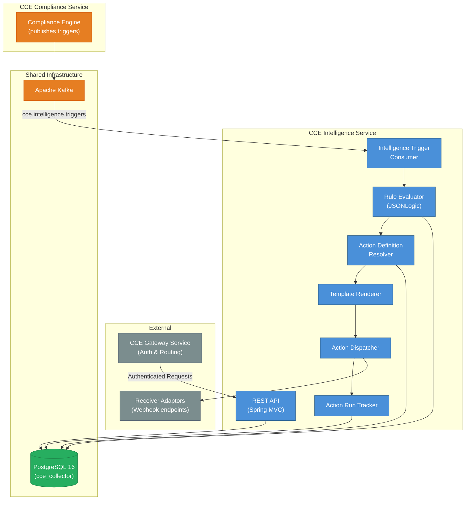
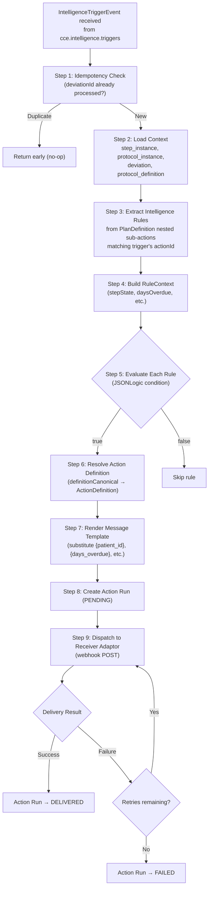
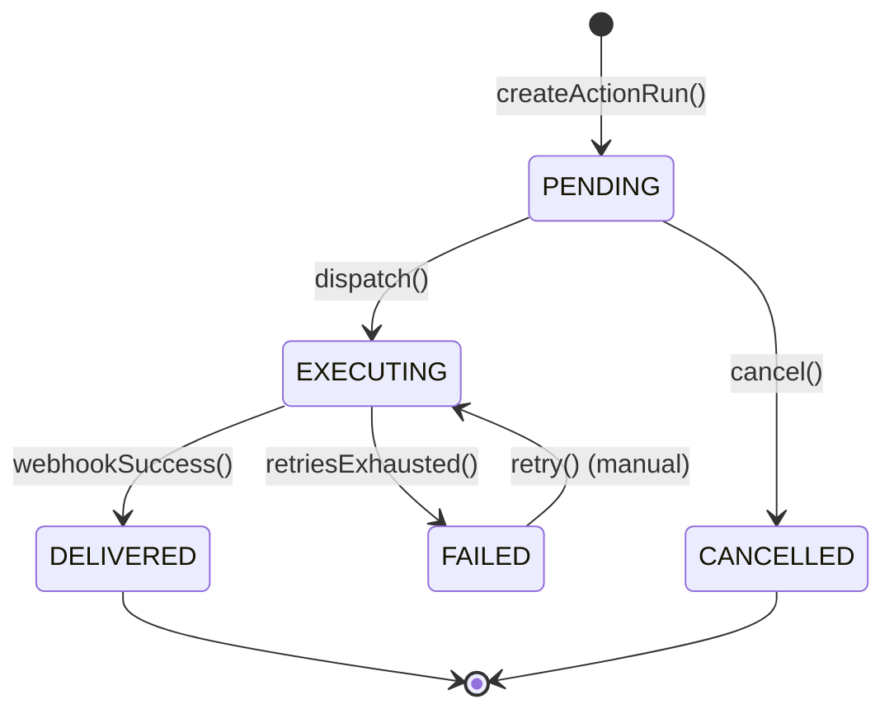

# Architecture & Design

## 1. System Context

The **CCE Intelligence Service** (referred to as "Intelligence Engine & Action Execution" in the Solution Design v0.3) is the action engine of the CCE platform. It consumes intelligence triggers from the Compliance Service, evaluates PlanDefinition-defined intelligence rules, executes actions (notifications, escalations, coordination) via registered Receiver Adaptors, and tracks action execution lifecycle.

> All REST requests arrive via the **CCE Gateway Service**, which validates OAuth tokens and enforces scopes (`action-definitions:read|write`, `action-runs:read|write`, `admin`). The Intelligence Service does not handle authentication or authorization.



**This service does NOT handle:** event ingestion (Collector), protocol matching (Compliance), time-based transitions (Scheduler), analytics dashboards (Insights), or authentication/authorization (Gateway).

> **Dependency: Compliance Service Intelligence Trigger Publishing**  
> The Intelligence Service depends on the Compliance Service publishing `IntelligenceTriggerEvent` messages to the `cce.intelligence.triggers` Kafka topic. As of **Compliance Service v1.0.0, this producer is not yet implemented** — the `IntelligenceTriggerEvent` model exists for schema documentation only. Intelligence trigger publishing is deferred to a future Compliance Service release, driven by PlanDefinition-level configuration. The Intelligence Service cannot process triggers until this producer is active.

---

## 2. Technology Stack

| Concern | Technology | Version |
|---------|------------|---------|
| Language | Java | 21 (LTS) |
| Framework | Spring Boot | 3.4.x |
| Build tool | Gradle | 8.x |
| Database | PostgreSQL | 16+ (shared with all CCE services) |
| Message broker | Apache Kafka | 3.7+ (KRaft mode) |
| DB access | Spring Data JPA + Hibernate | (Spring Boot managed) |
| DB migration | Flyway | (Spring Boot managed) |
| Connection pool | HikariCP | (Spring Boot default) |
| Expression evaluation | Apache Johnzon JsonLogic | 2.0.2 |
| HTTP client | Spring WebClient (reactive, non-blocking) | (Spring Boot managed) |
| Observability | Micrometer + Prometheus | (Spring Boot managed) |
| Testing | JUnit 5, Testcontainers, MockMvc | |

### Key Gradle Dependencies

```groovy
// Spring Boot starters
implementation 'org.springframework.boot:spring-boot-starter-web'
implementation 'org.springframework.boot:spring-boot-starter-data-jpa'
implementation 'org.springframework.boot:spring-boot-starter-actuator'
implementation 'org.springframework.boot:spring-boot-starter-validation'
implementation 'org.springframework.boot:spring-boot-starter-webflux'  // WebClient for webhook delivery
implementation 'org.springframework.kafka:spring-kafka'

// Database
runtimeOnly 'org.postgresql:postgresql'
implementation 'org.flywaydb:flyway-core'
implementation 'org.flywaydb:flyway-database-postgresql'

// Expression evaluation
implementation 'org.apache.johnzon:johnzon-jsonlogic:2.0.2'

// Observability
implementation 'io.micrometer:micrometer-registry-prometheus'

// Testing
testImplementation 'org.springframework.boot:spring-boot-starter-test'
testImplementation 'org.springframework.kafka:spring-kafka-test'
testImplementation 'org.testcontainers:postgresql'
testImplementation 'org.testcontainers:kafka'
testImplementation 'org.testcontainers:junit-jupiter'
testImplementation 'com.squareup.okhttp3:mockwebserver'  // Mock webhook endpoints
```

**Not included:** HAPI FHIR (PlanDefinition intelligence rules are parsed as JSONB — no FHIR R4 runtime), Redis (no caching in 1.0.0).

---

## 3. Package Structure

```
src/main/java/org/openphc/cce/intelligence/
├── IntelligenceServiceApplication.java           # @SpringBootApplication
├── config/
│   ├── KafkaConsumerConfig.java                   # Consumer factory, error handler, DLQ
│   ├── WebClientConfig.java                       # WebClient for webhook delivery
│   ├── JpaConfig.java                             # JPA/Hibernate settings
│   └── ObservabilityConfig.java                   # Custom metrics
├── domain/
│   ├── entity/
│   │   ├── ActionDefinition.java                  # Registered action (message template, routing, type)
│   │   ├── ActionRun.java                         # Execution record per fired rule
│   │   ├── ReceiverAdaptor.java                   # Registered webhook endpoint
│   │   ├── ActionAuditLog.java                    # Audit trail entry
│   │   ├── ProtocolDefinition.java                # Read-only entity (@Immutable)
│   │   ├── ProtocolInstance.java                  # Read-only entity (@Immutable)
│   │   ├── StepInstance.java                      # Read-only entity (@Immutable)
│   │   └── Deviation.java                         # Read-only entity (@Immutable)
│   ├── enums/
│   │   ├── ActionRunStatus.java                   # PENDING, EXECUTING, DELIVERED, FAILED, CANCELLED
│   │   ├── ActionType.java                        # NOTIFICATION, ESCALATION, COORDINATION
│   │   ├── DeliveryMode.java                      # WEBHOOK (1.0.0); TOPIC_SUBSCRIPTION (future)
│   │   └── IntelligenceSeverity.java              # LOW, MEDIUM, HIGH, CRITICAL
│   └── repository/
│       ├── ActionDefinitionRepository.java
│       ├── ActionRunRepository.java
│       ├── ReceiverAdaptorRepository.java
│       ├── ActionAuditLogRepository.java
│       ├── ProtocolDefinitionRepository.java      # Read-only
│       ├── ProtocolInstanceRepository.java        # Read-only
│       ├── StepInstanceRepository.java            # Read-only
│       └── DeviationRepository.java               # Read-only
├── engine/
│   ├── IntelligenceEngine.java                    # Core orchestrator — trigger → evaluate → execute
│   ├── RuleEvaluator.java                         # JSONLogic condition evaluation against step runtime
│   ├── RuleContext.java                            # Record: stepState, daysOverdue, daysPastMissedDate, etc.
│   └── IntelligenceRule.java                      # Record: ruleId, condition, definitionCanonical, severity, target
├── action/
│   ├── ActionDefinitionResolver.java              # Resolve definitionCanonical → ActionDefinition entity
│   ├── TemplateRenderer.java                      # Variable substitution in message templates
│   ├── ActionDispatcher.java                      # Routes rendered action to Receiver Adaptor
│   └── WebhookDeliveryClient.java                 # WebClient-based HTTP POST to adaptor endpoint
├── kafka/
│   ├── IntelligenceTriggerConsumer.java            # @KafkaListener for cce.intelligence.triggers
│   └── IntelligenceTriggerEvent.java              # Inbound Kafka message record
├── service/
│   ├── ActionDefinitionService.java               # CRUD for action definitions
│   ├── ActionRunService.java                      # Action run lifecycle management
│   ├── ReceiverAdaptorService.java                # Adaptor registration and lookup
│   └── ActionAuditService.java                    # @Async audit logging
└── web/
    ├── controller/
    │   ├── ActionDefinitionController.java
    │   ├── ActionRunController.java
    │   └── ReceiverAdaptorController.java
    ├── dto/
    │   ├── ActionDefinitionDto.java
    │   ├── ActionRunDto.java
    │   ├── ReceiverAdaptorDto.java
    │   └── DtoMapper.java
    └── GlobalExceptionHandler.java

src/main/resources/
├── application.yml
├── application-docker.yml
└── db/migration/
    └── V1__create_intelligence_tables.sql

src/test/java/org/openphc/cce/intelligence/           # Unit tests
src/integrationTest/java/org/openphc/cce/intelligence/ # Integration tests
```

**Total:** ~35 source files across 12 packages.

---

## 4. Core Pipeline — IntelligenceEngine

The `IntelligenceEngine` is the central orchestrator. All intelligence trigger processing flows through it:



### 4.1 Intelligence Rules in PlanDefinition

Intelligence rules are modeled as **nested sub-actions** within a PlanDefinition step action:

```json
{
  "id": "anc-visit-2",
  "title": "Second ANC Visit",
  "action": [
    {
      "id": "anc-visit-2-overdue-alert",
      "title": "Alert — overdue notification",
      "condition": [{
        "kind": "applicability",
        "expression": {
          "language": "text/jsonlogic",
          "expression": "{\"==\": [{\"var\": \"stepState\"}, \"overdue\"]}"
        }
      }],
      "definitionCanonical": "ActivityDefinition/send-alert",
      "extension": [
        { "url": "http://openphc.org/fhir/StructureDefinition/intelligence-severity", "valueCode": "medium" },
        { "url": "http://openphc.org/fhir/StructureDefinition/intelligence-target", "valueCode": "facility" }
      ]
    },
    {
      "id": "anc-visit-2-overdue-escalation",
      "title": "Escalation — supervisor (3+ days overdue)",
      "condition": [{
        "kind": "applicability",
        "expression": {
          "language": "text/jsonlogic",
          "expression": "{\"and\": [{\"==\": [{\"var\": \"stepState\"}, \"overdue\"]}, {\">\": [{\"var\": \"daysOverdue\"}, 3]}]}"
        }
      }],
      "definitionCanonical": "ActivityDefinition/send-escalation",
      "extension": [
        { "url": "http://openphc.org/fhir/StructureDefinition/intelligence-severity", "valueCode": "high" },
        { "url": "http://openphc.org/fhir/StructureDefinition/intelligence-target", "valueCode": "supervisor" }
      ]
    }
  ]
}
```

The Intelligence Service extracts these nested sub-actions at runtime, evaluates their JSONLogic conditions, and executes the referenced Action Definitions.

### 4.2 Rule Context Binding

For each intelligence trigger, a `RuleContext` is built from the Compliance Service's database:

```java
record RuleContext(
    String stepState,           // step_instance.state (lowercase)
    int daysOverdue,            // computed: now - overdue_date (0 if not overdue)
    int daysPastMissedDate,     // computed: now - missed_date (0 if not missed)
    String deviationType,       // deviation.deviation_type
    String protocolCanonical,   // protocol_instance.protocol_canonical
    String actionId,            // step_instance.action_id
    String requiredBehavior,    // step_instance.required_behavior
    String patientId,           // protocol_instance.patient_id
    String facilityId           // from trigger event
) {}
```

### 4.3 Template Rendering

Action Definitions contain message templates with `{variable}` placeholders:

```
"Patient {patient_id} ANC visit is {days_overdue} days overdue at facility {facility_id}"
```

Variables are resolved from the `RuleContext` + trigger event metadata.

---

## 5. Action Execution & Delivery

### 5.1 Webhook Delivery (1.0.0)

The Intelligence Service delivers actions by POSTing a JSON payload to the Receiver Adaptor's registered webhook URL:

```http
POST https://facility-adaptor.example.com/cce/actions
Content-Type: application/json

{
  "actionRunId": "aaaa-bbbb-cccc-dddd",
  "actionType": "ESCALATION",
  "severity": "high",
  "target": "supervisor",
  "subject": "260225-0002-5501",
  "protocolCanonical": "http://openphc.org/fhir/PlanDefinition/anc-high-risk|2.1",
  "actionId": "anc-visit-2",
  "facilityId": "0002",
  "message": "Patient 260225-0002-5501 ANC visit is 5 days overdue",
  "detectedAt": "2026-03-25T00:00:05Z",
  "metadata": {
    "dueDate": "2026-03-20T00:00:00Z",
    "overdueDate": "2026-03-25T00:00:00Z",
    "daysOverdue": 5
  }
}
```

### 5.2 Retry Strategy (1.0.0)

- Fixed-interval retry: 3 attempts, 2-second delay between retries
- On exhaustion: Action Run status → `FAILED`, details logged
- No exponential backoff in 1.0.0

### 5.3 Delivery Modes

| Mode | Status | How It Works |
|---|---|---|
| **Webhook (Push)** | 1.0.0 | Intelligence Service POSTs to adaptor's registered URL |
| **Topic Subscription (Pull)** | Future | Adaptor subscribes to a Kafka topic; pulls events at its own pace |

---

## 6. State Machines

### 6.1 Action Run



### 6.2 Receiver Adaptor

`ACTIVE` → `INACTIVE` (deregistered or disabled). Only `ACTIVE` adaptors receive dispatched actions.

---

## 7. Security

- **Authentication & Authorization:** Handled by the **CCE API Gateway**. This service does not implement security directly.
- **Webhook delivery:** Uses HTTPS for adaptor endpoints. Adaptor URL validation enforced on registration.
- Actuator endpoints are publicly accessible for health checks and monitoring.

---

## 8. Observability

### 8.1 Metrics (Micrometer)

| Metric | Type | Tags | Description |
|---|---|---|---|
| `cce.intelligence.triggers.received` | Counter | `deviation_type` | Triggers received from Kafka |
| `cce.intelligence.rules.evaluated` | Counter | `result` (matched/skipped) | Rules evaluated per trigger |
| `cce.intelligence.actions.dispatched` | Counter | `action_type`, `severity` | Actions dispatched to adaptors |
| `cce.intelligence.actions.delivered` | Counter | `action_type` | Successfully delivered actions |
| `cce.intelligence.actions.failed` | Counter | `action_type` | Failed action deliveries |
| `cce.intelligence.webhook.duration` | Timer | `adaptor_id` | Webhook POST response time |
| `cce.intelligence.consumer.errors` | Counter | — | Consumer processing errors |

### 8.2 Health Indicators

| Indicator | Details |
|---|---|
| `db` (auto) | PostgreSQL connectivity |
| `kafka` (auto) | Kafka broker connectivity |
| `diskSpace` (auto) | Disk space availability |

---

## 9. Error Handling

### 9.1 REST API

| Error Type | HTTP Status |
|---|---|
| Resource not found | 404 |
| Invalid input / validation | 400 |
| Duplicate resource | 409 |
| Internal error | 500 |

### 9.2 Kafka Consumer

- **Consumer errors:** Exception propagates to `DefaultErrorHandler` → retries with fixed backoff → routes to DLQ (`cce.intelligence.triggers.dlq`)
- **Retry configuration:** 3 attempts, 1-second backoff
- **Deserialization:** `ErrorHandlingDeserializer` wrapping for poison pill protection

### 9.3 Webhook Delivery

- **Timeout:** 10-second connection timeout, 30-second read timeout
- **Retry:** Fixed 3 attempts with 2-second delay
- **On failure:** Action Run → `FAILED`, full error details persisted

---

## 10. Scaling & Deployment

| Dimension | Strategy |
|---|---|
| **Horizontal** | Kafka consumer group enables multi-instance; partition assignment is automatic (25 partitions) |
| **Database** | Connection pool per instance; mix of read-write (own tables) and read-only (compliance tables) |
| **Kafka** | 3 concurrent listener threads per instance |
| **API** | Stateless — any instance serves any request |
| **Webhook** | WebClient non-blocking I/O — high throughput without thread-per-request |
