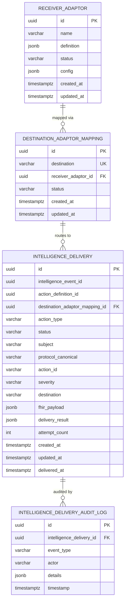

# Data Dictionary

> **CCE Intelligence Service** — Complete database schema reference  
> **Database**: PostgreSQL 16 | **Schema**: `public` | **Migration**: Flyway  
> **Last Updated**: 2026-05-04

---

## Table of Contents

1. [Entity Relationship Diagram](#1-entity-relationship-diagram)
2. [Table Summary](#2-table-summary)
3. [receiver_adaptor](#3-receiver_adaptor) (owned)
4. [destination_adaptor_mapping](#4-destination_adaptor_mapping) (owned)
5. [intelligence_delivery](#5-intelligence_delivery) (owned)
6. [intelligence_delivery_audit_log](#6-intelligence_delivery_audit_log) (owned)
7. [Compliance Service Tables](#7-compliance-service-tables--not-accessed-at-runtime)
8. [Enumerated Value Reference](#8-enumerated-value-reference)
9. [JSONB Column Schemas](#9-jsonb-column-schemas)
10. [Configuration Properties](#10-configuration-properties)
11. [Metrics](#11-metrics)

---

## 1. Entity Relationship Diagram



> **No read-only tables on the hot path.** The trigger event is self-contained (fat event) — the Intelligence Service does **not** read any Compliance Service tables (`intelligence_event_log`, `action_definition`, etc.) during trigger processing. The `intelligence_event_id` and `action_definition_id` columns on `intelligence_delivery` are populated from the trigger event for traceability, not as runtime FKs.

---

## 2. Table Summary

| # | Table | Owner | Purpose | Row Growth |
|---|-------|-------|---------|-----------|
| 1 | `receiver_adaptor` | Intelligence Service | Registered webhook endpoints for action delivery | Low (handful) |
| 2 | `destination_adaptor_mapping` | Intelligence Service | 1:1 routing map: destination → receiver adaptor | Low |
| 3 | `intelligence_delivery` | Intelligence Service | Delivery lifecycle per (intelligence_event × adaptor) | High (per intelligence_event × adaptor) |
| 4 | `intelligence_delivery_audit_log` | Intelligence Service | Audit trail for delivery lifecycle events | High |

> The Intelligence Service owns all 4 tables. It does **not** read any Compliance Service tables at runtime — the trigger event carries all necessary metadata (fat event design).

---

## 3. receiver_adaptor

Stores registered **Receiver Adaptors** — external webhook endpoints that receive intelligence actions. The adaptor's identity, address, and payload capabilities are stored as a **FHIR R4 Endpoint** resource in the `definition` column. Routing from destinations to adaptors is managed via the `destination_adaptor_mapping` table.

### Columns

| Column | Data Type | Nullable | Default | Description |
|--------|-----------|----------|---------|-------------|
| `id` | `UUID` | **NOT NULL** | `gen_random_uuid()` | Primary key. |
| `name` | `VARCHAR` | **NOT NULL** | — | Human-readable adaptor name. Must match `definition.name`. Denormalized for unique constraint and listing queries. |
| `definition` | `JSONB` | **NOT NULL** | — | FHIR R4 **Endpoint** resource. Contains the adaptor's address, connection type, supported payload types, and status. See [JSONB: definition](#receiver_adaptor--definition). |
| `status` | `VARCHAR` | **NOT NULL** | `'ACTIVE'` | `ACTIVE` or `INACTIVE`. Only active adaptors receive deliveries. |
| `config` | `JSONB` | Yes | — | Additional adaptor configuration (auth headers, retry overrides, custom headers). See [JSONB: config](#receiver_adaptor--config). |
| `created_at` | `TIMESTAMPTZ` | **NOT NULL** | `now()` | Registration timestamp. |
| `updated_at` | `TIMESTAMPTZ` | **NOT NULL** | `now()` | Last update timestamp. |

> **FHIR alignment:** The `definition` column stores a complete FHIR Endpoint resource. The `WebhookDeliveryClient` reads the delivery address from `definition->'address'` and the connection type from `definition->'connectionType'->>'code'` at dispatch time.

### Constraints & Indexes

| Type | Name | Details |
|------|------|---------|
| Primary Key | `receiver_adaptor_pkey` | `id` |
| Unique | `receiver_adaptor_name_key` | `name` — Unique adaptor name. |
| Check | — | `definition->>'resourceType' = 'Endpoint'` |
| Check | — | `definition->>'address' IS NOT NULL` |
| Check | — | `status IN ('ACTIVE', 'INACTIVE')` |

---

## 4. destination_adaptor_mapping

Maps an **intelligence destination** to a **Receiver Adaptor** — a simple 1:1 routing table. Each destination (e.g., `supervisor`, `patient-reminder`, `lab-coordinator`) is mapped to exactly one Receiver Adaptor. The `destination` column is unique, ensuring a single delivery target per destination name.

### Columns

| Column | Data Type | Nullable | Default | Description |
|--------|-----------|----------|---------|-------------|
| `id` | `UUID` | **NOT NULL** | `gen_random_uuid()` | Primary key. |
| `destination` | `VARCHAR` | **NOT NULL** | — | Intelligence destination name (e.g., `supervisor`, `patient-reminder`, `lab-coordinator`). Unique — each destination maps to exactly one adaptor. |
| `receiver_adaptor_id` | `UUID` | **NOT NULL** | — | FK → `receiver_adaptor.id`. The adaptor that receives deliveries for this destination. |
| `status` | `VARCHAR` | **NOT NULL** | `'ACTIVE'` | `ACTIVE` or `INACTIVE`. Only active mappings are used for routing. |
| `created_at` | `TIMESTAMPTZ` | **NOT NULL** | `now()` | Mapping creation timestamp. |
| `updated_at` | `TIMESTAMPTZ` | **NOT NULL** | `now()` | Last update timestamp. |

### Constraints & Indexes

| Type | Name | Details |
|------|------|---------|
| Primary Key | `destination_adaptor_mapping_pkey` | `id` |
| Unique | `destination_adaptor_mapping_destination_key` | `destination` — Each destination maps to exactly one adaptor. |
| Foreign Key | `destination_adaptor_mapping_receiver_adaptor_id_fkey` | `receiver_adaptor_id` → `receiver_adaptor(id)` |
| Check | — | `status IN ('ACTIVE', 'INACTIVE')` |
| B-tree Index | `idx_destination_adaptor_mapping_adaptor` | `receiver_adaptor_id` — Find all mappings for an adaptor. |
| Partial B-tree | `idx_destination_adaptor_mapping_active` | `status WHERE status = 'ACTIVE'` — Active mapping queries. |

### Routing Query

```sql
SELECT dam.id, dam.receiver_adaptor_id, ra.definition->>'address' AS endpoint_url, ra.definition, ra.config
FROM destination_adaptor_mapping dam
JOIN receiver_adaptor ra ON ra.id = dam.receiver_adaptor_id
WHERE dam.destination = :intelligenceDestination
  AND dam.status = 'ACTIVE'
  AND ra.status = 'ACTIVE'
```

### Routing Example

| Destination | Receiver Adaptor | Purpose |
|---|---|---|
| `supervisor` | CHW Team Lead SMS Gateway | Supervisor escalations delivered via SMS |
| `patient-reminder` | WhatsApp Bot Adaptor | Patient reminders via WhatsApp |
| `lab-coordinator` | Lab Coordinator Dashboard | Lab coordination tasks to dashboard |
| `district-health-office` | District Health Office API | District-level alerts |

---

## 5. intelligence_delivery

Tracks the **delivery lifecycle** of an intelligence action to a specific Receiver Adaptor. One row per `(intelligence_event, destination_adaptor_mapping)` combination. The `(intelligence_event_id, destination_adaptor_mapping_id)` compound key enforces idempotency — if duplicate trigger events arrive for the same intelligence event, only the first creates an intelligence delivery. All metadata columns (`action_type`, `severity`, `destination`, `action_id`, etc.) are populated directly from the trigger event — no Compliance table reads required.

### Columns

| Column | Data Type | Nullable | Default | Description |
|--------|-----------|----------|---------|-------------|
| `id` | `UUID` | **NOT NULL** | `gen_random_uuid()` | Primary key. |
| `intelligence_event_id` | `UUID` | **NOT NULL** | — | Compliance Service's `intelligence_event_log.id`. Idempotency anchor. Stored for traceability, not used as a runtime FK. |
| `action_definition_id` | `UUID` | **NOT NULL** | — | Compliance Service's `action_definition.id`. Stored for traceability, not used as a runtime FK. |
| `destination_adaptor_mapping_id` | `UUID` | Yes | — | FK → `destination_adaptor_mapping.id`. Which mapping routed this delivery. `NULL` if no matching mapping found. |
| `action_type` | `VARCHAR` | **NOT NULL** | — | FHIR resource type stored directly from the trigger event's `actionType` (FHIR `ActivityDefinition.kind`): `CommunicationRequest`, `Task`, or `ServiceRequest`. Determines FHIR payload resource type. |
| `status` | `VARCHAR` | **NOT NULL** | — | Delivery status. See [IntelligenceDeliveryStatus](#intelligencedeliverystatus). |
| `subject` | `VARCHAR` | **NOT NULL** | — | Patient UPID. From trigger event `subject`. |
| `protocol_canonical` | `VARCHAR` | **NOT NULL** | — | Protocol `url\|version`. From trigger event `protocolCanonical`. |
| `action_id` | `VARCHAR` | **NOT NULL** | — | PlanDefinition action ID (e.g., `anc-visit-2`). From trigger event `actionId`. |
| `severity` | `VARCHAR` | **NOT NULL** | — | Intelligence severity. From trigger event `severity`. See [IntelligenceSeverity](#intelligenceseverity). |
| `destination` | `VARCHAR` | **NOT NULL** | — | Intelligence destination (e.g., `supervisor`). From trigger event `intelligenceDestination`. |
| `fhir_payload` | `JSONB` | **NOT NULL** | — | The FHIR R4 resource (CommunicationRequest, Task, or passthrough ServiceRequest payload) sent to the adaptor. See [JSONB: fhir_payload](#intelligence_delivery--fhir_payload). |
| `delivery_result` | `JSONB` | Yes | — | Delivery response details (HTTP status, error message, attempts). See [JSONB: delivery_result](#intelligence_delivery--delivery_result). |
| `attempt_count` | `INTEGER` | **NOT NULL** | `0` | Number of delivery attempts made. |
| `created_at` | `TIMESTAMPTZ` | **NOT NULL** | `now()` | When the intelligence delivery was created. |
| `updated_at` | `TIMESTAMPTZ` | **NOT NULL** | `now()` | Last status change. |
| `delivered_at` | `TIMESTAMPTZ` | Yes | — | When the action was successfully delivered. `NULL` if not yet delivered. |

### Constraints & Indexes

| Type | Name | Details |
|------|------|---------|
| Primary Key | `intelligence_delivery_pkey` | `id` |
| Foreign Key | `intelligence_delivery_destination_adaptor_mapping_id_fkey` | `destination_adaptor_mapping_id` → `destination_adaptor_mapping(id)` |
| Unique | `intelligence_delivery_event_mapping_key` | `(intelligence_event_id, destination_adaptor_mapping_id)` — Idempotency guard. One delivery per intelligence event per destination mapping. **Note:** PostgreSQL treats NULLs as distinct in unique constraints, so multiple rows with `destination_adaptor_mapping_id = NULL` for the same `intelligence_event_id` will not conflict. |
| Check | — | `action_type IN ('CommunicationRequest', 'Task', 'ServiceRequest')` |
| Check | — | `status IN ('PENDING', 'EXECUTING', 'DELIVERED', 'FAILED', 'CANCELLED')` |
| Check | — | `severity IN ('LOW', 'MEDIUM', 'HIGH', 'CRITICAL')` |
| B-tree Index | `idx_intelligence_delivery_intelligence_event` | `intelligence_event_id` — Lookup all deliveries for an intelligence event. |
| B-tree Index | `idx_intelligence_delivery_status` | `status` — Filter by delivery status. |
| B-tree Index | `idx_intelligence_delivery_subject` | `subject` — Patient-centric queries. |
| Partial B-tree | `idx_intelligence_delivery_failed` | `status WHERE status = 'FAILED'` — Quick failed delivery queries. |

---

## 6. intelligence_delivery_audit_log

Audit trail for delivery lifecycle events. Written asynchronously (`@Async`) to avoid blocking the main processing pipeline.

### Columns

| Column | Data Type | Nullable | Default | Description |
|--------|-----------|----------|---------|-------------|
| `id` | `UUID` | **NOT NULL** | `gen_random_uuid()` | Primary key. |
| `intelligence_delivery_id` | `UUID` | **NOT NULL** | — | FK → `intelligence_delivery.id`. |
| `event_type` | `VARCHAR` | **NOT NULL** | — | Lifecycle event: `CREATED`, `DISPATCHED`, `DELIVERED`, `FAILED`, `CANCELLED`, `RETRIED`. |
| `actor` | `VARCHAR` | **NOT NULL** | `'system'` | Who/what caused the event (`system` for automated, user ID for manual). |
| `details` | `JSONB` | Yes | — | Event-specific details (HTTP status, error message, adaptor info). |
| `timestamp` | `TIMESTAMPTZ` | **NOT NULL** | `now()` | When the event occurred. |

### Constraints & Indexes

| Type | Name | Details |
|------|------|---------|
| Primary Key | `intelligence_delivery_audit_log_pkey` | `id` |
| Foreign Key | `intelligence_delivery_audit_log_intelligence_delivery_id_fkey` | `intelligence_delivery_id` → `intelligence_delivery(id)` |
| B-tree Index | `idx_intelligence_delivery_audit_log_run` | `intelligence_delivery_id` — All audit entries for a delivery. |
| B-tree Index | `idx_intelligence_delivery_audit_log_timestamp` | `timestamp` — Time-range queries. |

---

## 7. Compliance Service Tables — Not Accessed at Runtime

With the **fat event design**, the Intelligence Service does not read any Compliance Service tables during trigger processing. All metadata needed for routing and FHIR payload construction (`actionType`, `severity`, `intelligenceDestination`, `protocolDefinitionId`, `actionDefinitionId`) is carried in the `IntelligenceTriggerEvent` published by the Compliance Service via Kafka.

The `intelligence_event_id` and `action_definition_id` columns on `intelligence_delivery` are stored for **traceability and cross-service correlation** only — they enable diagnostic joins in data warehouses or ad-hoc queries but are not used as runtime foreign keys.

### Tables Not Read by Intelligence Service

| Table | Owner | What It Stores | Intelligence Service Relationship |
|-------|-------|----------------|----------------------------------|
| `intelligence_event_log` | Compliance Service | Intelligence action evaluation records | `intelligence_event_id` stored for traceability only |
| `action_definition` | Compliance Service | FHIR ActivityDefinition resources | `action_definition_id` stored for traceability only |
| `protocol_instance` | Compliance Service | Active protocol enrollments | Not referenced |
| `protocol_definition` | Compliance Service | Protocol metadata | Not referenced |
| `step_instance` | Compliance Service | Step lifecycle tracking | Not referenced |

> **Impact:** The Intelligence Service has **zero `@Immutable` JPA entities** and **zero read-only repositories**. All metadata is carried in the self-contained trigger event.

---

## 8. Enumerated Value Reference

### IntelligenceDeliveryStatus

| Value | Description |
|-------|-------------|
| `PENDING` | Intelligence delivery created, not yet dispatched |
| `EXECUTING` | Dispatch in progress (webhook call active) |
| `DELIVERED` | Successfully delivered to Receiver Adaptor |
| `FAILED` | Delivery failed after all retry attempts |
| `CANCELLED` | Manually cancelled via API |

### ActionType

Stored directly from the trigger event's `actionType` field — the FHIR `ActivityDefinition.kind` value. No secondary mapping is applied.

| `action_type` Value | FHIR Payload Resource | Description |
|---|---|---|
| `CommunicationRequest` | `CommunicationRequest` | Alert, reminder, or notification |
| `Task` | `Task` | Cross-system task creation |
| `ServiceRequest` (with `eventPayload`) | **Passthrough** — original `eventPayload` from Compliance Service | Referral or lab order |
| `ServiceRequest` (without `eventPayload`) | `ServiceRequest` (built by FhirPayloadBuilder) | Referral or lab order |

### ConnectionType (FHIR Endpoint)

The delivery mechanism is defined by the FHIR Endpoint `connectionType` in `receiver_adaptor.definition`, using the standard FHIR [endpoint-connection-type](http://terminology.hl7.org/CodeSystem/endpoint-connection-type) CodeSystem:

| Code | Display | Description |
|------|---------|-------------|
| `hl7-fhir-rest` | HL7 FHIR REST | RESTful FHIR endpoint (webhook POST) |
| `hl7-fhir-msg` | HL7 FHIR Messaging | FHIR messaging endpoint |
| `secure-email` | Secure Email | Secure email delivery |

### IntelligenceSeverity

| Value | Description | Typical Use |
|-------|-------------|-------------|
| `LOW` | Informational | Reminders |
| `MEDIUM` | Attention needed | First overdue alert |
| `HIGH` | Urgent action required | Escalation after threshold |
| `CRITICAL` | Immediate intervention | Missed critical step |

---

## 9. JSONB Column Schemas

### `receiver_adaptor` → `definition`

A **FHIR R4 Endpoint** resource describing the adaptor's identity, connection type, supported payload types, and address.

```json
{
  "resourceType": "Endpoint",
  "id": "openmrs-prod",
  "status": "active",
  "connectionType": {
    "system": "http://terminology.hl7.org/CodeSystem/endpoint-connection-type",
    "code": "hl7-fhir-rest",
    "display": "HL7 FHIR REST"
  },
  "name": "OpenMRS Production FHIR R4",
  "payloadType": [
    {
      "coding": [
        { "system": "http://hl7.org/fhir/resource-types", "code": "CommunicationRequest" }
      ]
    }
  ],
  "payloadMimeType": ["application/fhir+json"],
  "address": "https://openmrs.example.org/ws/fhir2/R4"
}
```

| Field | FHIR Path | Description |
|-------|-----------|-------------|
| Adaptor ID | `Endpoint.id` | Logical identifier within the Endpoint resource. |
| Status | `Endpoint.status` | FHIR lifecycle status (`active`, `suspended`, `error`, `off`). Application uses the table-level `status` column for routing decisions. |
| Connection type | `Endpoint.connectionType` | Protocol/mechanism (e.g., `hl7-fhir-rest`, `hl7-fhir-msg`, `secure-email`). |
| Name | `Endpoint.name` | Human-readable name. Must match the table's `name` column. |
| Payload types | `Endpoint.payloadType` | FHIR resource types this endpoint accepts (`CommunicationRequest`, `Task`). |
| MIME types | `Endpoint.payloadMimeType` | Accepted content types (typically `application/fhir+json`). |
| Address | `Endpoint.address` | Webhook URL for action delivery. Must be HTTPS in production. |

> **Validation:** On `POST /v1/receiver-adaptors`, the service validates that `definition.resourceType == "Endpoint"`, `definition.address` is a valid URL, and `definition.name` matches the top-level `name` field.

### `receiver_adaptor` → `config`

**Credential ownership:** The external Receiver Adaptor operator generates and manages their own auth credentials (API keys, bearer tokens, etc.). A CCE admin registers the adaptor via `POST /v1/receiver-adaptors`, placing the operator-provided credentials into `config`. The `WebhookDeliveryClient` reads `authHeader` + `authValue` at dispatch time and injects them into the outbound HTTP request. The Intelligence Service never *issues* tokens — it only *stores and presents* credentials that the receiving system expects.

> **Security note:** `authValue` contains sensitive credentials and should be encrypted at rest in production (e.g., via PostgreSQL pgcrypto or application-level encryption). Credentials are **never logged** — the `WebhookDeliveryClient` masks them in all log output. `authValue` is **never returned** in REST API responses — DTOs mask it (e.g., `sk-***123`).

> **Webhook signing (HMAC):** When `webhookSecret` is configured, the `WebhookDeliveryClient` computes `HMAC-SHA256(webhookSecret, requestBody)` and sends it as the `X-CCE-Signature-256` header. The receiving system verifies the signature to confirm the request originates from the CCE platform. If `webhookSecret` is `null`, signing is skipped (backward compatible).

> **Separation of concerns:** The FHIR Endpoint in `definition` describes *what* the adaptor is and *where* to deliver. The `config` JSONB stores *how* to authenticate, sign, and operational overrides — concerns that are outside the FHIR Endpoint spec.

```json
{
  "authHeader": "X-API-Key",
  "authValue": "********",
  "webhookSecret": "whsec_abc123...",
  "timeoutMs": 10000,
  "retryOverride": {
    "maxAttempts": 5,
    "intervalMs": 3000
  },
  "customHeaders": {
    "X-Source-System": "cce-intelligence"
  }
}
```

| Field | Type | Required | Description |
|-------|------|----------|-------------|
| `authHeader` | String | No | HTTP header name for authentication (e.g., `X-API-Key`, `Authorization`). |
| `authValue` | String | No | Authentication credential value. **Encrypted at rest; masked in API responses.** |
| `webhookSecret` | String | No | Shared secret for HMAC-SHA256 request signing. When present, `WebhookDeliveryClient` computes signature and sends as `X-CCE-Signature-256` header. |
| `timeoutMs` | Integer | No | Per-adaptor read timeout override (ms). Falls back to `cce.intelligence.webhook.read-timeout-ms`. |
| `retryOverride.maxAttempts` | Integer | No | Per-adaptor retry attempts override. Falls back to `cce.intelligence.webhook.retry-attempts`. |
| `retryOverride.intervalMs` | Integer | No | Per-adaptor retry interval override (ms). Falls back to `cce.intelligence.webhook.retry-interval-ms`. |
| `customHeaders` | Map | No | Additional HTTP headers injected into every webhook request to this adaptor. |

> **Platform headers (always sent):** In addition to `config.customHeaders` and `config.authHeader`, the `WebhookDeliveryClient` always injects these platform headers on every webhook POST:
> - `Content-Type: application/fhir+json`
> - `X-CCE-Intelligence-Delivery-Id: {intelligenceDeliveryId}` — Unique intelligence delivery identifier for correlation.
> - `X-CCE-Intelligence-Event-Id: {intelligenceEventId}` — Compliance Service intelligence event ID for cross-service tracing.
> - `X-CCE-Signature-256: {hmac}` — HMAC-SHA256 signature (only if `webhookSecret` is configured).

### `intelligence_delivery` → `fhir_payload`

The FHIR R4-compliant resource sent to the Receiver Adaptor. Resource type depends on the trigger event's `actionType`:
- `NOTIFICATION` / `ESCALATION` → `CommunicationRequest`
- `COORDINATION` (Task) → `Task`
- `COORDINATION` (ServiceRequest with `eventPayload`) → **Passthrough** — the original `eventPayload` from the Compliance Service is used as-is
- `COORDINATION` (ServiceRequest without `eventPayload`) → `ServiceRequest` (built by `FhirPayloadBuilder`)

```json
{
  "resourceType": "CommunicationRequest",
  "identifier": [{
    "system": "http://openphc.org/fhir/intelligence-delivery-id",
    "value": "aaaa-bbbb-cccc-dddd"
  }],
  "status": "active",
  "priority": "urgent",
  "category": [{
    "coding": [{
      "system": "http://openphc.org/fhir/CodeSystem/cce-action-type",
      "code": "ESCALATION",
      "display": "Escalation"
    }]
  }],
  "subject": {
    "identifier": { "system": "http://openphc.org/fhir/patient-upid", "value": "260225-0002-5501" }
  },
  "about": [
    { "reference": "PlanDefinition/anc-high-risk|2.1" },
    { "display": "anc-visit-2" }
  ],
  "payload": [{
    "contentString": "[HIGH] ESCALATION for patient 260225-0002-5501 — step anc-visit-2 overdue (PlanDefinition/anc-high-risk|2.1)"
  }],
  "recipient": [{ "display": "supervisor" }],
  "authoredOn": "2026-04-15T00:00:05Z",
  "extension": [
    { "url": "http://openphc.org/fhir/StructureDefinition/cce-severity", "valueCode": "high" },
    { "url": "http://openphc.org/fhir/StructureDefinition/cce-intelligence-event-id", "valueId": "intelligence-event-uuid" },
    { "url": "http://openphc.org/fhir/StructureDefinition/cce-step-state", "valueCode": "overdue" }
  ]
}
```

### `intelligence_delivery` → `delivery_result`

```json
{
  "httpStatus": 200,
  "responseBody": "{\"status\": \"accepted\"}",
  "deliveredAt": "2026-03-25T00:00:10Z",
  "attempts": [
    { "attempt": 1, "status": 503, "error": "Service Unavailable", "at": "2026-03-25T00:00:06Z" },
    { "attempt": 2, "status": 200, "at": "2026-03-25T00:00:10Z" }
  ]
}
```

### `intelligence_delivery_audit_log` → `details`

Content varies by event type:

| Event Type | Example |
|---|---|
| `DISPATCHED` | `{"adaptorName": "Kigali South SMS Gateway", "endpointUrl": "https://sms.example.com/webhook"}` |
| `DELIVERED` | `{"httpStatus": 200, "responseBody": "{\"status\": \"accepted\"}"}` |
| `FAILED` | `{"httpStatus": 503, "error": "Service Unavailable", "attemptCount": 3}` |
| `RETRIED` | `{"attempt": 2, "previousStatus": 503, "nextRetryAt": "2026-03-25T00:00:08Z"}` |

---

## 10. Configuration Properties

| Property | Type | Default | Description |
|----------|------|---------|-------------|
| `cce.intelligence.webhook.connect-timeout-ms` | `int` | `5000` | WebClient connection timeout |
| `cce.intelligence.webhook.read-timeout-ms` | `int` | `10000` | WebClient read timeout |
| `cce.intelligence.webhook.retry-attempts` | `int` | `3` | Max delivery retry attempts |
| `cce.intelligence.webhook.retry-interval-ms` | `long` | `2000` | Delay between retries |

---

## 11. Metrics

| Metric Name | Type | Tags | Description |
|-------------|------|------|-------------|
| `cce.intelligence.triggers.received` | Counter | `trigger_type` | Triggers received from Kafka |
| `cce.intelligence.deliveries.dispatched` | Counter | `action_type`, `severity` | Deliveries dispatched to adaptors |
| `cce.intelligence.deliveries.delivered` | Counter | `action_type` | Successful deliveries |
| `cce.intelligence.deliveries.failed` | Counter | `action_type` | Failed deliveries |
| `cce.intelligence.webhook.duration` | Timer | `adaptor_name` | Webhook response time |
| `cce.intelligence.consumer.errors` | Counter | — | Consumer processing errors |
| `cce.intelligence.destinations.active` | Gauge | — | Active destination-adaptor mappings |

---

## 12. Data Retention

`intelligence_delivery` and `intelligence_delivery_audit_log` are high-growth tables (one row per intelligence event × adaptor, plus audit entries per lifecycle event). Without a retention strategy, these tables will grow unbounded.

| Strategy | Table | Details |
|---|---|---|
| **Range partitioning** | `intelligence_delivery`, `intelligence_delivery_audit_log` | Partition by `created_at` / `timestamp` using native PostgreSQL range partitioning or `pg_partman` for automated partition management. Monthly partitions recommended. |
| **Active retention** | Both | Keep the most recent 90 days in active partitions for operational queries. |
| **Archive** | Both | Detach and move partitions older than the retention window to cold storage (S3, Azure Blob). Retain for regulatory compliance period (consult healthcare data retention policy). |
| **Indexes** | Both | Partial indexes on `status` (e.g., `WHERE status = 'FAILED'`) ensure fast queries on active data without scanning archived partitions. |

> **Regulatory note:** Healthcare compliance may require retaining delivery records for extended periods (e.g., 7 years). The archival strategy must balance operational performance with regulatory retention requirements.
