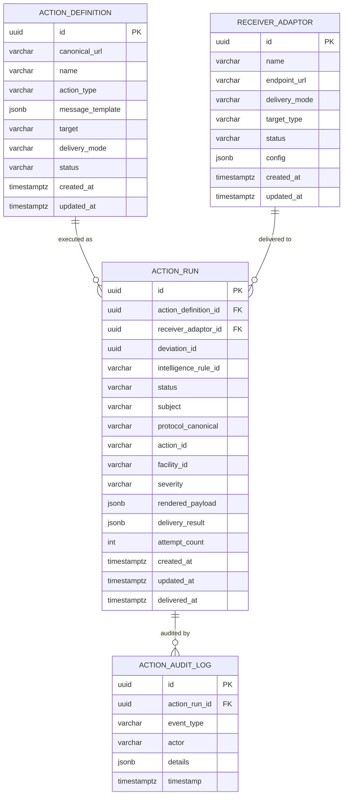

# Data Dictionary

> **CCE Intelligence Service** — Complete database schema reference  
> **Database**: PostgreSQL 16 | **Schema**: `public` | **Migration**: Flyway  
> **Last Updated**: 2026-03-30

---

## Table of Contents

1. [Entity Relationship Diagram](#1-entity-relationship-diagram)
2. [Table Summary](#2-table-summary)
3. [action_definition](#3-action_definition) (owned)
4. [action_run](#4-action_run) (owned)
5. [receiver_adaptor](#5-receiver_adaptor) (owned)
6. [action_audit_log](#6-action_audit_log) (owned)
7. [Read-Only Tables](#7-read-only-tables-compliance-service)
8. [Enumerated Value Reference](#8-enumerated-value-reference)
9. [JSONB Column Schemas](#9-jsonb-column-schemas)
10. [Configuration Properties](#10-configuration-properties)
11. [Metrics](#11-metrics)

---

## 1. Entity Relationship Diagram



---

## 2. Table Summary

| # | Table | Owner | Purpose | Row Growth |
|---|-------|-------|---------|-----------|
| 1 | `action_definition` | Intelligence Service | Registered action templates (what to do when intelligence fires) | Low (tens) |
| 2 | `action_run` | Intelligence Service | Execution record per fired intelligence rule | High (per deviation × rule) |
| 3 | `receiver_adaptor` | Intelligence Service | Registered webhook endpoints for action delivery | Low (handful) |
| 4 | `action_audit_log` | Intelligence Service | Audit trail for action lifecycle events | High |
| 5 | `protocol_definition` | Compliance Service | PlanDefinition with intelligence rules (read-only) | — |
| 6 | `protocol_instance` | Compliance Service | Patient enrollment context (read-only) | — |
| 7 | `step_instance` | Compliance Service | Step runtime state for rule evaluation (read-only) | — |
| 8 | `deviation` | Compliance Service | Deviation triggering intelligence (read-only) | — |

---

## 3. action_definition

Stores registered **Action Definitions** — templates that define what CCE does when an intelligence rule fires. Referenced by PlanDefinition intelligence rules via `definitionCanonical` (e.g., `ActivityDefinition/send-alert`).

### Columns

| Column | Data Type | Nullable | Default | Description |
|--------|-----------|----------|---------|-------------|
| `id` | `UUID` | **NOT NULL** | `gen_random_uuid()` | Primary key. |
| `canonical_url` | `VARCHAR` | **NOT NULL** | — | Canonical reference used by PlanDefinition `definitionCanonical` (e.g., `ActivityDefinition/send-alert`). Must be unique. |
| `name` | `VARCHAR` | **NOT NULL** | — | Human-readable name (e.g., "Send Overdue Alert"). |
| `action_type` | `VARCHAR` | **NOT NULL** | — | Type of action. See [ActionType](#actiontype). |
| `message_template` | `JSONB` | **NOT NULL** | — | Template with `{variable}` placeholders. See [JSONB: message_template](#action_definition--message_template). |
| `target` | `VARCHAR` | **NOT NULL** | — | Routing target type (e.g., `supervisor`, `facility`, `chw-app`). Matched against `receiver_adaptor.target_type`. |
| `delivery_mode` | `VARCHAR` | **NOT NULL** | `'WEBHOOK'` | How to deliver. See [DeliveryMode](#deliverymode). |
| `status` | `VARCHAR` | **NOT NULL** | `'ACTIVE'` | `ACTIVE` or `INACTIVE`. Only active definitions are executed. |
| `created_at` | `TIMESTAMPTZ` | **NOT NULL** | `now()` | Record creation timestamp. |
| `updated_at` | `TIMESTAMPTZ` | **NOT NULL** | `now()` | Last modification timestamp. |

### Constraints & Indexes

| Type | Name | Details |
|------|------|---------|
| Primary Key | `action_definition_pkey` | `id` |
| Unique | `action_definition_canonical_url_key` | `canonical_url` — Unique canonical reference. |
| Check | — | `action_type IN ('NOTIFICATION', 'ESCALATION', 'COORDINATION')` |
| Check | — | `delivery_mode IN ('WEBHOOK')` |
| Check | — | `status IN ('ACTIVE', 'INACTIVE')` |
| B-tree Index | `idx_action_definition_target` | `target` — Fast target-based lookup. |

---

## 4. action_run

Tracks the **execution lifecycle** of a fired intelligence rule. One row per `(deviation, intelligence_rule)` combination. Records the rendered payload, delivery attempts, and outcome.

### Columns

| Column | Data Type | Nullable | Default | Description |
|--------|-----------|----------|---------|-------------|
| `id` | `UUID` | **NOT NULL** | `gen_random_uuid()` | Primary key. |
| `action_definition_id` | `UUID` | **NOT NULL** | — | FK → `action_definition.id`. Which action template was executed. |
| `receiver_adaptor_id` | `UUID` | Yes | — | FK → `receiver_adaptor.id`. Which adaptor received the action. `NULL` if no matching adaptor found. |
| `deviation_id` | `UUID` | **NOT NULL** | — | The deviation that triggered this action. Used for idempotency with `intelligence_rule_id`. |
| `intelligence_rule_id` | `VARCHAR` | **NOT NULL** | — | PlanDefinition sub-action `id` (e.g., `anc-visit-2-overdue-escalation`). |
| `status` | `VARCHAR` | **NOT NULL** | — | Execution status. See [ActionRunStatus](#actionrunstatus). |
| `subject` | `VARCHAR` | **NOT NULL** | — | Patient UPID. |
| `protocol_canonical` | `VARCHAR` | **NOT NULL** | — | Protocol `url\|version`. |
| `action_id` | `VARCHAR` | **NOT NULL** | — | PlanDefinition step action ID. |
| `facility_id` | `VARCHAR` | Yes | — | FOSA facility ID from trigger. |
| `severity` | `VARCHAR` | **NOT NULL** | — | Intelligence severity. See [IntelligenceSeverity](#intelligenceseverity). |
| `rendered_payload` | `JSONB` | **NOT NULL** | — | The fully rendered action payload sent to the adaptor. |
| `delivery_result` | `JSONB` | Yes | — | Delivery response details (HTTP status, error message). See [JSONB: delivery_result](#action_run--delivery_result). |
| `attempt_count` | `INTEGER` | **NOT NULL** | `0` | Number of delivery attempts made. |
| `created_at` | `TIMESTAMPTZ` | **NOT NULL** | `now()` | When the action run was created. |
| `updated_at` | `TIMESTAMPTZ` | **NOT NULL** | `now()` | Last status change. |
| `delivered_at` | `TIMESTAMPTZ` | Yes | — | When the action was successfully delivered. `NULL` if not yet delivered. |

### Constraints & Indexes

| Type | Name | Details |
|------|------|---------|
| Primary Key | `action_run_pkey` | `id` |
| Foreign Key | `action_run_action_definition_id_fkey` | `action_definition_id` → `action_definition(id)` |
| Foreign Key | `action_run_receiver_adaptor_id_fkey` | `receiver_adaptor_id` → `receiver_adaptor(id)` |
| Unique | `action_run_deviation_rule_key` | `(deviation_id, intelligence_rule_id)` — Idempotency guard. |
| Check | — | `status IN ('PENDING', 'EXECUTING', 'DELIVERED', 'FAILED', 'CANCELLED')` |
| Check | — | `severity IN ('LOW', 'MEDIUM', 'HIGH', 'CRITICAL')` |
| B-tree Index | `idx_action_run_status` | `status` — Filter by execution status. |
| B-tree Index | `idx_action_run_subject` | `subject` — Patient-centric queries. |
| B-tree Index | `idx_action_run_deviation` | `deviation_id` — Lookup runs for a deviation. |
| Partial B-tree | `idx_action_run_failed` | `status WHERE status = 'FAILED'` — Quick failed run queries. |

---

## 5. receiver_adaptor

Stores registered **Receiver Adaptors** — external webhook endpoints that receive intelligence actions.

### Columns

| Column | Data Type | Nullable | Default | Description |
|--------|-----------|----------|---------|-------------|
| `id` | `UUID` | **NOT NULL** | `gen_random_uuid()` | Primary key. |
| `name` | `VARCHAR` | **NOT NULL** | — | Human-readable name (e.g., "Kigali South Facility Adaptor"). |
| `endpoint_url` | `VARCHAR` | **NOT NULL** | — | Webhook URL for action delivery (must be HTTPS in production). |
| `delivery_mode` | `VARCHAR` | **NOT NULL** | `'WEBHOOK'` | Delivery mode. See [DeliveryMode](#deliverymode). |
| `target_type` | `VARCHAR` | **NOT NULL** | — | Target routing identifier (e.g., `supervisor`, `facility`, `chw-app`). Matched against `action_definition.target`. |
| `status` | `VARCHAR` | **NOT NULL** | `'ACTIVE'` | `ACTIVE` or `INACTIVE`. Only active adaptors receive actions. |
| `config` | `JSONB` | Yes | — | Additional adaptor configuration (e.g., auth headers, retry overrides). See [JSONB: config](#receiver_adaptor--config). |
| `created_at` | `TIMESTAMPTZ` | **NOT NULL** | `now()` | Registration timestamp. |
| `updated_at` | `TIMESTAMPTZ` | **NOT NULL** | `now()` | Last update timestamp. |

### Constraints & Indexes

| Type | Name | Details |
|------|------|---------|
| Primary Key | `receiver_adaptor_pkey` | `id` |
| Unique | `receiver_adaptor_name_key` | `name` — Unique adaptor name. |
| Check | — | `delivery_mode IN ('WEBHOOK')` |
| Check | — | `status IN ('ACTIVE', 'INACTIVE')` |
| B-tree Index | `idx_receiver_adaptor_target` | `target_type` — Fast target-based routing. |

---

## 6. action_audit_log

Audit trail for action execution lifecycle events. Written asynchronously (`@Async`) to avoid blocking the main processing pipeline.

### Columns

| Column | Data Type | Nullable | Default | Description |
|--------|-----------|----------|---------|-------------|
| `id` | `UUID` | **NOT NULL** | `gen_random_uuid()` | Primary key. |
| `action_run_id` | `UUID` | **NOT NULL** | — | FK → `action_run.id`. |
| `event_type` | `VARCHAR` | **NOT NULL** | — | Lifecycle event (e.g., `CREATED`, `DISPATCHED`, `DELIVERED`, `FAILED`, `CANCELLED`, `RETRIED`). |
| `actor` | `VARCHAR` | **NOT NULL** | `'system'` | Who/what caused the event (`system` for automated, user ID for manual). |
| `details` | `JSONB` | Yes | — | Event-specific details (e.g., HTTP status code, error message). |
| `timestamp` | `TIMESTAMPTZ` | **NOT NULL** | `now()` | When the event occurred. |

### Constraints & Indexes

| Type | Name | Details |
|------|------|---------|
| Primary Key | `action_audit_log_pkey` | `id` |
| Foreign Key | `action_audit_log_action_run_id_fkey` | `action_run_id` → `action_run(id)` |
| B-tree Index | `idx_action_audit_log_run` | `action_run_id` — All audit entries for a run. |
| B-tree Index | `idx_action_audit_log_timestamp` | `timestamp` — Time-range queries. |

---

## 7. Read-Only Tables (Compliance Service)

The Intelligence Service reads these tables but **never writes** to them. Entities use `@Immutable`.

### 7.1 `protocol_definition`

| Column | Type | Used By Intelligence | Purpose |
|--------|------|---------------------|---------|
| `id` | `UUID` | Yes | PK — join for loading PlanDefinition |
| `url` | `VARCHAR` | Yes | Protocol canonical URL |
| `version` | `VARCHAR` | Yes | Protocol version |
| `status` | `VARCHAR` | Yes | Filter active protocols |
| `definition` | `JSONB` | **Yes** | Extract intelligence rules (nested sub-actions with conditions + definitionCanonical) |
| `loaded_at` | `TIMESTAMPTZ` | No | — |

### 7.2 `protocol_instance`

| Column | Type | Used By Intelligence | Purpose |
|--------|------|---------------------|---------|
| `id` | `UUID` | Yes | PK |
| `patient_id` | `VARCHAR` | Yes | Patient UPID for template rendering |
| `protocol_canonical` | `VARCHAR` | Yes | Protocol ref for context |
| `protocol_definition_id` | `UUID` | Yes | FK to load PlanDefinition intelligence rules |
| `enrolled_at` | `TIMESTAMPTZ` | Yes | Enrollment timestamp — available for template variables |
| `status` | `VARCHAR` | Yes | Only process for `ACTIVE` instances |
| `created_at` | `TIMESTAMPTZ` | No | Record creation timestamp |
| `updated_at` | `TIMESTAMPTZ` | No | Last modification timestamp |

### 7.3 `step_instance`

| Column | Type | Used By Intelligence | Purpose |
|--------|------|---------------------|---------|
| `id` | `UUID` | Yes | PK |
| `protocol_instance_id` | `UUID` | Yes | FK to protocol |
| `action_id` | `VARCHAR` | Yes | Match to PlanDefinition action for nested rules |
| `repeat_index` | `INTEGER` | No | Zero-based occurrence counter for repeating actions |
| `state` | `VARCHAR` | Yes | Step state for RuleContext (`stepState`) |
| `due_date` | `TIMESTAMPTZ` | Yes | Scheduled due date |
| `overdue_date` | `TIMESTAMPTZ` | Yes | Compute `daysOverdue` |
| `missed_date` | `TIMESTAMPTZ` | Yes | Compute `daysPastMissedDate` |
| `required_behavior` | `VARCHAR` | Yes | RuleContext variable (`must`, `could`, `must-unless-documented`) |

### 7.4 `deviation`

| Column | Type | Used By Intelligence | Purpose |
|--------|------|---------------------|---------|
| `id` | `UUID` | Yes | PK — also the idempotency key |
| `protocol_instance_id` | `UUID` | Yes | FK to protocol |
| `step_instance_id` | `UUID` | Yes | FK to step |
| `deviation_type` | `VARCHAR` | Yes | RuleContext variable |
| `detected_at` | `TIMESTAMPTZ` | Yes | Trigger timestamp |
| `intelligence_event_id` | `UUID` | No (read-only) | Reserved for future phase. Links to the intelligence trigger event published to Kafka when PlanDefinition-driven intelligence triggers are enabled by the Compliance Service. **NULL in Compliance Service v1.0.0.** |
| `metadata` | `JSONB` | Yes | Additional computation context |

---

## 8. Enumerated Value Reference

### ActionRunStatus

| Value | Description |
|-------|-------------|
| `PENDING` | Action run created, not yet dispatched |
| `EXECUTING` | Dispatch in progress (webhook call active) |
| `DELIVERED` | Successfully delivered to Receiver Adaptor |
| `FAILED` | Delivery failed after all retry attempts |
| `CANCELLED` | Manually cancelled via API |

### ActionType

| Value | Description |
|-------|-------------|
| `NOTIFICATION` | Alert or reminder sent to a participating system |
| `ESCALATION` | Elevated alert sent to supervisor or higher authority |
| `COORDINATION` | Cross-system task creation or data routing |

### DeliveryMode

| Value | Description | Status |
|-------|-------------|--------|
| `WEBHOOK` | HTTP POST to adaptor endpoint | 1.0.0 |
| `TOPIC_SUBSCRIPTION` | Adaptor pulls from a Kafka topic | Future |

### IntelligenceSeverity

| Value | Description | Typical Use |
|-------|-------------|-------------|
| `LOW` | Informational | Reminders |
| `MEDIUM` | Attention needed | First overdue alert |
| `HIGH` | Urgent action required | Escalation after threshold |
| `CRITICAL` | Immediate intervention | Missed critical step |

---

## 9. JSONB Column Schemas

### `action_definition` → `message_template`

```json
{
  "subject": "Overdue Alert: {protocol_canonical}",
  "body": "Patient {patient_id} {action_id} is {days_overdue} days overdue at facility {facility_id}",
  "variables": ["patient_id", "action_id", "days_overdue", "facility_id", "protocol_canonical"]
}
```

### `action_run` → `delivery_result`

```json
{
  "httpStatus": 200,
  "responseBody": "{\"status\": \"accepted\"}",
  "deliveredAt": "2026-03-25T00:00:10Z",
  "attempts": [
    { "attempt": 1, "status": 503, "error": "Service Unavailable", "at": "2026-03-25T00:00:06Z" },
    { "attempt": 2, "status": 200, "at": "2026-03-25T00:00:10Z" }
  ]
}
```

### `receiver_adaptor` → `config`

```json
{
  "authHeader": "X-API-Key",
  "authValue": "********",
  "timeoutMs": 10000,
  "retryOverride": {
    "maxAttempts": 5,
    "intervalMs": 3000
  }
}
```

---

## 10. Configuration Properties

| Property | Type | Default | Description |
|----------|------|---------|-------------|
| `cce.intelligence.webhook.connect-timeout-ms` | `int` | `10000` | WebClient connection timeout |
| `cce.intelligence.webhook.read-timeout-ms` | `int` | `30000` | WebClient read timeout |
| `cce.intelligence.webhook.retry-attempts` | `int` | `3` | Max delivery retry attempts |
| `cce.intelligence.webhook.retry-interval-ms` | `long` | `2000` | Delay between retries |

---

## 11. Metrics

| Metric Name | Type | Tags | Description |
|-------------|------|------|-------------|
| `cce.intelligence.triggers.received` | Counter | `deviation_type` | Triggers received from Kafka |
| `cce.intelligence.rules.evaluated` | Counter | `result` | Rules evaluated (matched/skipped) |
| `cce.intelligence.actions.dispatched` | Counter | `action_type`, `severity` | Actions dispatched to adaptors |
| `cce.intelligence.actions.delivered` | Counter | `action_type` | Successful deliveries |
| `cce.intelligence.actions.failed` | Counter | `action_type` | Failed deliveries |
| `cce.intelligence.webhook.duration` | Timer | `adaptor_id` | Webhook response time |
| `cce.intelligence.consumer.errors` | Counter | — | Consumer processing errors |
