# Flow Diagrams

> **CCE Intelligence Service** — Visual representation of core processing flows  
> All diagrams use [Mermaid](https://mermaid.js.org/) syntax.

---

## Table of Contents

1. [End-to-End Intelligence Pipeline](#1-end-to-end-intelligence-pipeline)
2. [Trigger Processing Sequence](#2-trigger-processing-sequence)
3. [Intelligence Rule Evaluation](#3-intelligence-rule-evaluation)
4. [Action Dispatch & Webhook Delivery](#4-action-dispatch--webhook-delivery)
5. [Action Run Lifecycle](#5-action-run-lifecycle)
6. [Retry & Error Handling](#6-retry--error-handling)
7. [REST API Flows](#7-rest-api-flows)

---

## 1. End-to-End Intelligence Pipeline

High-level data flow from Compliance Service deviation through to Receiver Adaptor delivery.

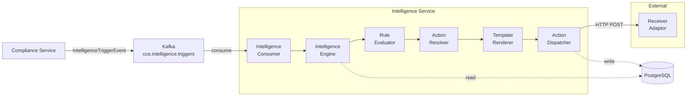

---

## 2. Trigger Processing Sequence

Detailed sequence diagram showing the interaction between components when processing an intelligence trigger.

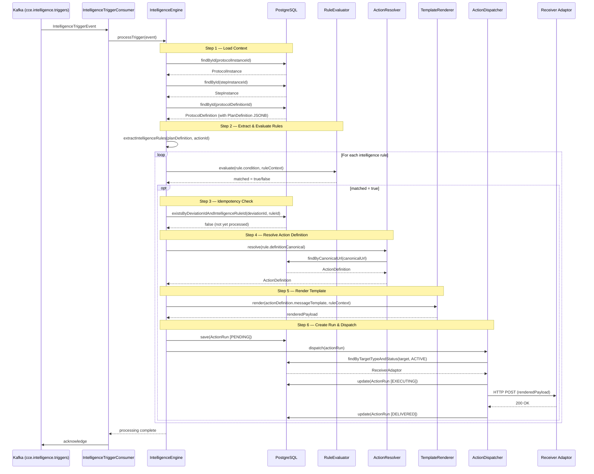

---

## 3. Intelligence Rule Evaluation

How intelligence rules are extracted from PlanDefinition and evaluated using JSONLogic.

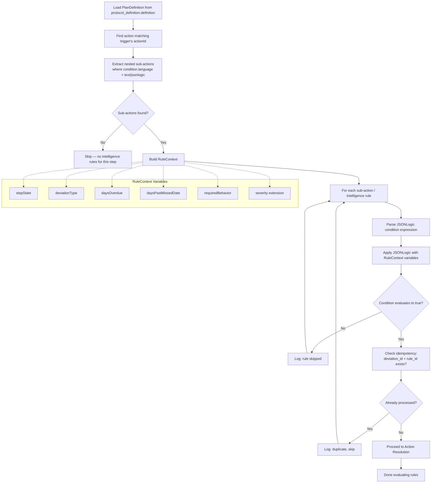

### RuleContext Variable Computation

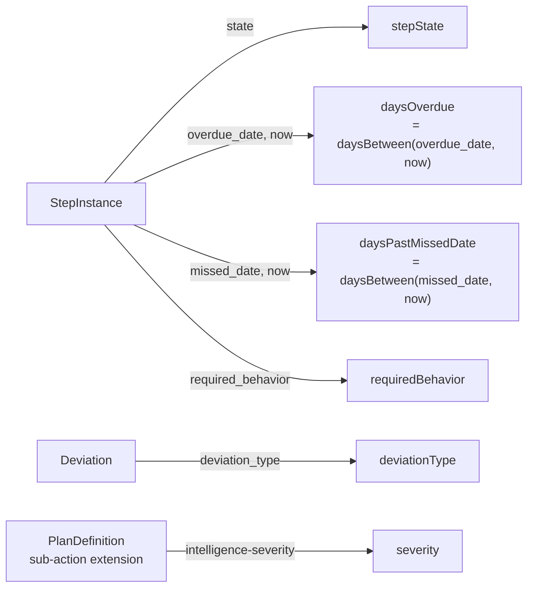

---

## 4. Action Dispatch & Webhook Delivery

How the Intelligence Service routes an action to the correct Receiver Adaptor and delivers via webhook.

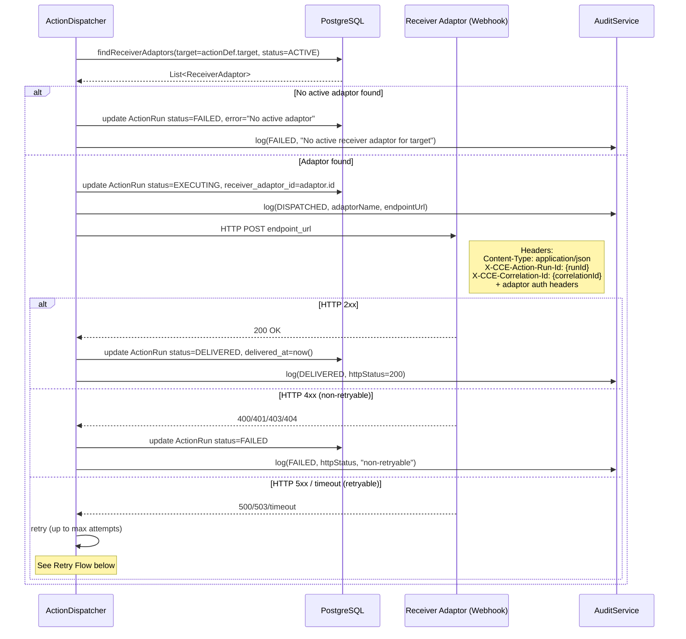

### Webhook Payload

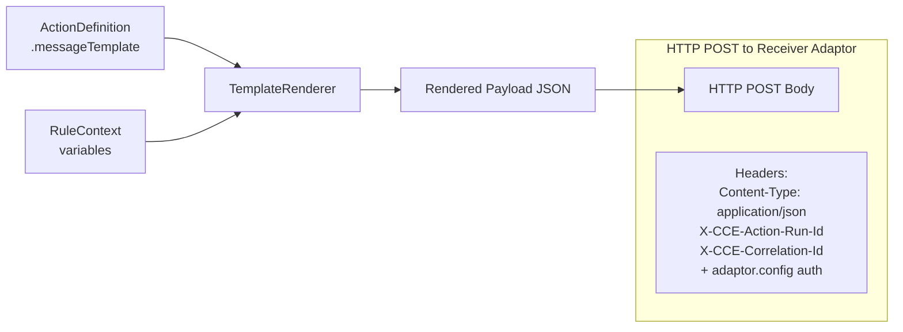

---

## 5. Action Run Lifecycle

State machine for `action_run.status` — all valid transitions.

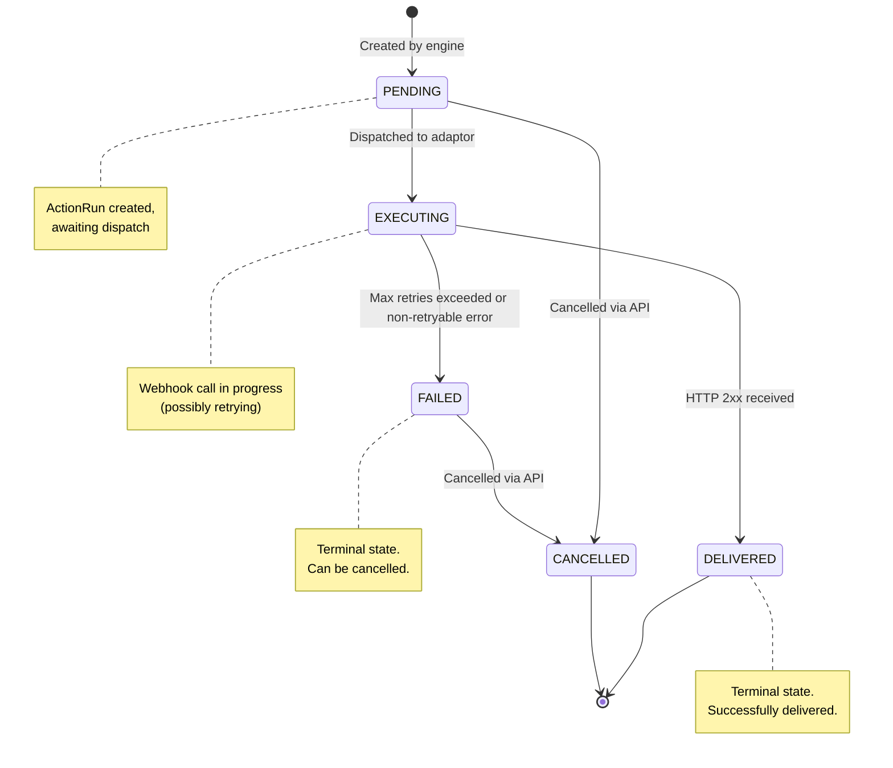

---

## 6. Retry & Error Handling

### 6.1 Webhook Delivery Retry

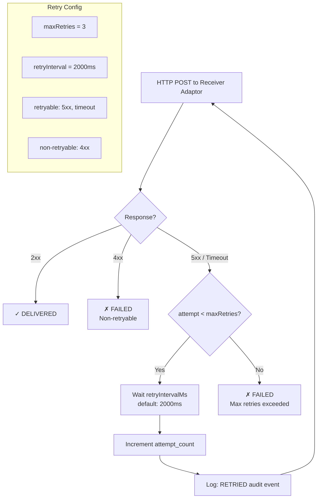

### 6.2 Kafka Consumer Error Handling

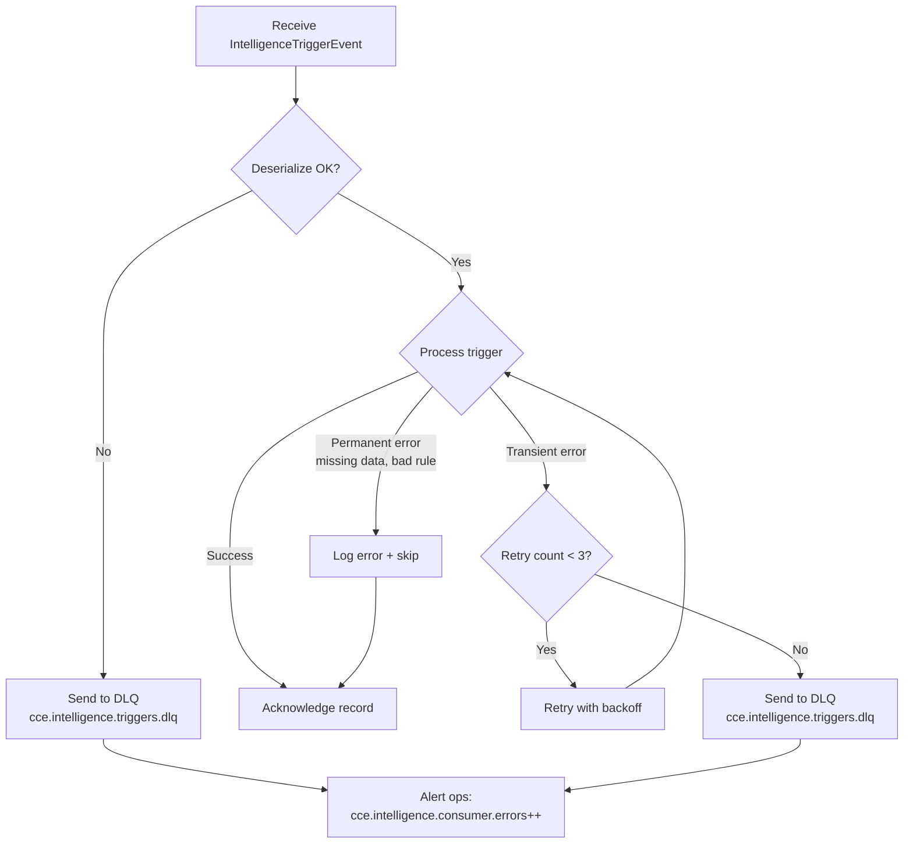

---

## 7. REST API Flows

### 7.1 Create Action Definition

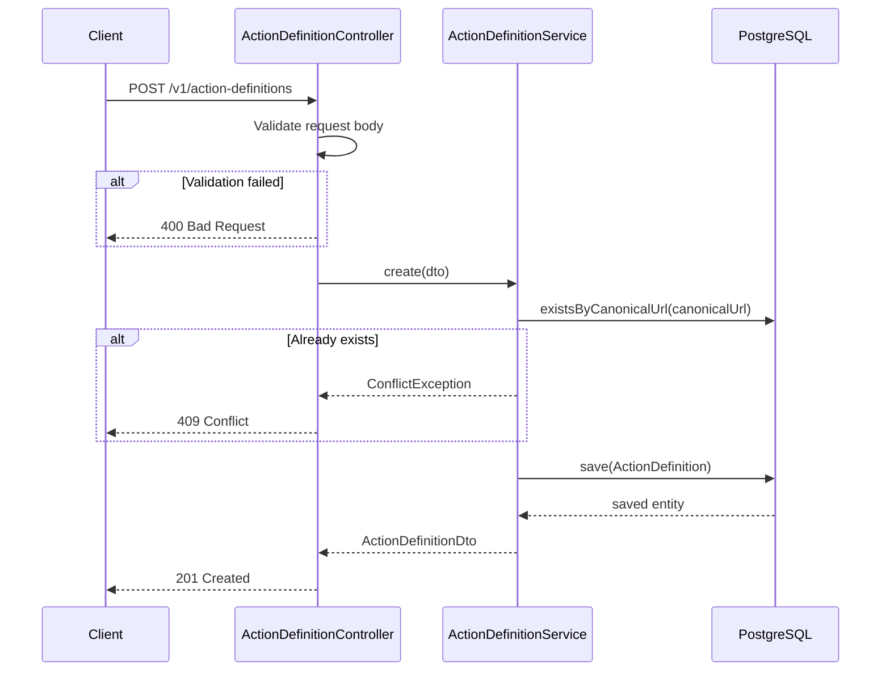

### 7.2 Cancel Action Run

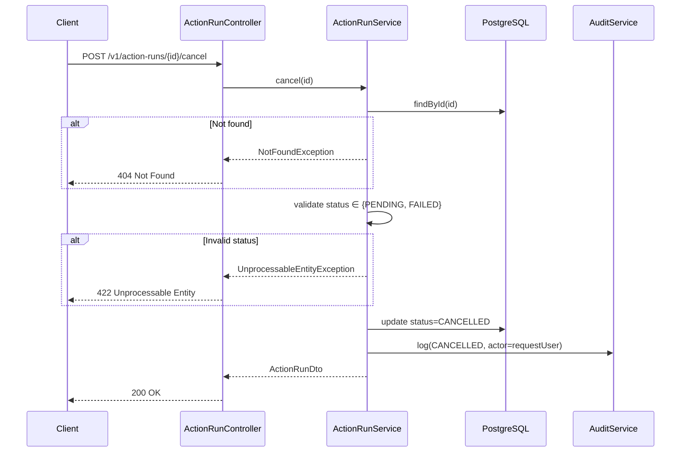
