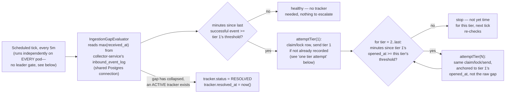
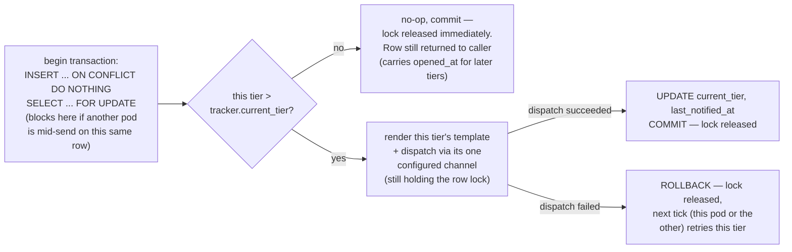
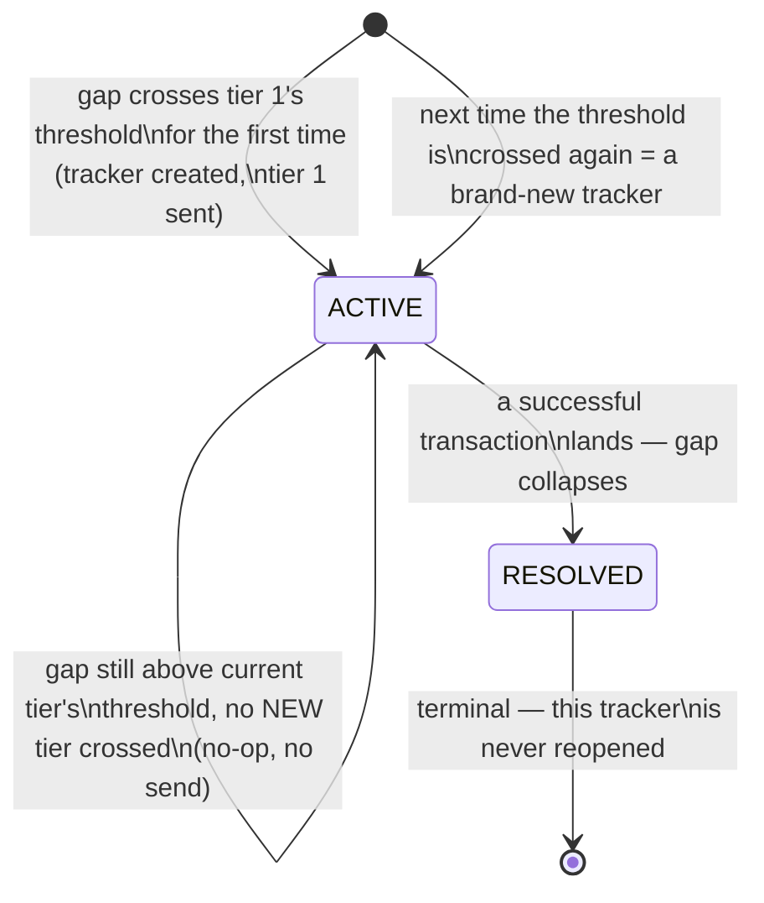

# Flow Diagrams

## Escalation flow (one scheduled tick)





**Step by step:**

1. Every 5 minutes, on every pod independently — there's no leader gate deciding who's allowed to run. For RI-63 there is one registered evaluator: `IngestionGapEvaluator`.
2. It computes minutes since the last successful transaction and compares against **tier 1's threshold only** — that's the only tier measured from the incident's true start. If not crossed, healthy, nothing to do.
3. If crossed, the engine always attempts tier 1 (claim/lock/send, per the "one tier attempt" flow above) — the evaluator having reported "unhealthy" already means tier 1's own condition is met.
4. **Every tier after that is measured differently**: not from the incident's start, but from tier 1's actual send time (`notification_tracker.opened_at`, returned by the tier 1 attempt regardless of whether it just sent or was already sent). For tier 2, then tier 3 in order: if `now - opened_at` hasn't reached that tier's configured threshold yet, stop for this tick — don't skip ahead, don't check later tiers early. If it has, attempt that tier the same way tier 1 was attempted.
5. Each tier attempt is its own claim-send-commit transaction, not one shared transaction for the whole catch-up sequence — so if tier 3 fails after tier 2 already succeeded this tick, tier 2's success stays committed rather than rolling back together with tier 3's failure.
6. On send: render that tier's template, dispatch via its one configured channel, still inside that tier's own transaction. Only on confirmed success does the engine update the tracker and commit — releasing the lock. On failure, rollback instead, releasing the lock just as fast; the failure surfaces as an SLF4J log line plus a `cce.opsalert.dispatch.failures` Micrometer counter, and the catch-up loop stops for this tick (next tick retries from wherever it left off).
7. Once `current_tier` reaches the last configured tier, escalation itself has nowhere further to go — there is no tier 4. Every later tick is a no-op for this catch-up sequence specifically, but not necessarily for the tracker as a whole: `attemptRepeat` runs right after this sequence every tick, independently re-checking "how long since `last_notified_at`" and — at the default `repeatIntervalMinutes` (1440, 24h) — resending the last tier's email once that interval has passed, indefinitely, for as long as the tracker stays `ACTIVE`. Its own claim-send-commit transaction, same shape as steps 5-6, just gated on elapsed time since the last send rather than on `current_tier` advancing (which it deliberately doesn't, here — see api-reference.md's "Operational controls" for why reusing this sequence's own tier-attempt logic doesn't work for a repeat). Only with `CCE_OPSALERT_REPEAT_INTERVAL_MINUTES` explicitly set to `<= 0` does this step become an unconditional no-op, matching the pre-repeat behavior.
8. The moment the gap collapses, the tracker closes. The next time the gap crosses tier 1's threshold, it's a new `reference_key`, a new tracker row, and the ladder restarts — including a fresh `opened_at` for tiers 2+ to anchor against.

**Why tiers 2+ aren't measured from the incident's start:** the PRD's own wording is explicit about this — "24 hours after **this alert**", "48 hours after **the initial technical alert**" — both phrased relative to when tier 1 was actually sent, not relative to when the outage technically began (which is usually a few hours earlier, exactly tier 1's own threshold). Measuring tiers 2+ from the incident start instead would make every later tier fire earlier than intended by roughly tier 1's own delay — a real, if modest, discrepancy from the specified escalation timing, not a rounding error.

## Incident lifecycle



Rules, stated exactly:

- **Opens** the instant the gap first exceeds tier 1's threshold — tier 1 is sent at creation, not on a later tick.
- **Escalates** each time `now - tracker.opened_at` (tier 1's actual send time) reaches the *next* configured tier's threshold. If the poller missed a window and enough time has passed to cross two tiers by the next check, they catch up in order in the same tick — nobody is skipped because of a monitoring gap. Note this is a different clock than the one that opened the incident: tier 1 is anchored to the last successful transaction; every tier after it is anchored to tier 1's own send time instead (see flow-diagrams.md's "why tiers 2+ aren't measured from the incident's start").
- **Goes silent** on any tick where `now - opened_at` is still above the *current* tier's threshold but hasn't reached the next one — including every tick after the last configured tier, forever, until resolution. Unconditional, not a repeat-interval approximation.
- **Closes** the instant an evaluator reports recovery for a tracker that's `ACTIVE` — *or* the instant a tick notices the active tracker's `reference_key` no longer matches the current occurrence (see "Missed recovery" below); permanently historical afterward either way — never reopened, never re-escalated.
- **Resets** by creating a brand-new tracker row on the next occurrence (a different `reference_key`), not by rewinding the closed one.

## Missed recovery between two polls

The "closes on recovery" rule above depends on some tick actually observing the healthy moment. If the gap fully recovers *and* breaks again between two consecutive polls — a recovery blip shorter than `poll-interval-ms` — no tick ever sees "healthy" in between, so `closeActive` (which only runs on that path) never fires. Left unhandled, that tracker stays `ACTIVE` forever: orphaned, still escalating on its *original* schedule against data that's no longer accurate, while a second, independent tracker gets created for the new occurrence — two trackers double-escalating one alert type instead of one.

`NotificationTrackerRepository.closeStale` closes this gap: every tick, before claiming or creating anything, the engine checks whether the currently `ACTIVE` tracker's `reference_key` still matches what the evaluator just computed *this* tick. A mismatch is proof the underlying data changed without ever being observed as healthy — so that tracker is resolved immediately, before a fresh one (anchored to the current `reference_key`) is claimed or created. Cheap and a no-op in the overwhelmingly common case where they already match.

Verified with a worked example: an active tracker was manually pinned to a `reference_key` that no longer matched real data. The next tick logged, in order:

```
opsalert: INGESTION_GAP — closed 1 stale tracker(s) whose occurrence no longer matches current data
opsalert: sent INGESTION_GAP tier 1 to ... — subject: "..."
```

— the stale row flipped to `RESOLVED`, and a new tracker (fresh `incident_id`, correctly anchored `opened_at`) opened and sent tier 1, all in the same tick.

## Concurrency safety — row-level locking, worked example

```mermaid
sequenceDiagram
    participant P1 as Pod 1
    participant P2 as Pod 2
    participant PG as Postgres (notification_tracker row)
    P1->>PG: BEGIN; INSERT ... ON CONFLICT DO NOTHING; SELECT ... FOR UPDATE
    PG-->>P1: row locked (uncontended)
    P2->>PG: BEGIN; INSERT ... ON CONFLICT DO NOTHING; SELECT ... FOR UPDATE
    Note over P2: blocks — P1 holds this row
    P1->>P1: dispatch email (tier N)
    P1->>PG: UPDATE current_tier=N; COMMIT
    Note over PG: lock released
    PG-->>P2: SELECT ... FOR UPDATE unblocks,\nsees current_tier already = N
    Note over P2: no-op, commit, done — never sent
```

**Why this is enough on its own:** the only thing that could break it is two pods locking *different* rows for what should be the same incident — and that can't happen. `reference_key` isn't independently chosen by each pod; it's `MAX(received_at)` read from one shared Postgres table, and under `READ COMMITTED` isolation, two reads with no intervening write return the identical value. Since "the incident is still open" means no new successful transaction has landed, `reference_key` is invariant for the entire lifetime of one incident — every pod, every tick, computes the same value. The only way it could differ is a new event landing in the split second between two reads — which isn't two pods disagreeing about an ongoing incident, it's the incident resolving right then (worst case: one legitimate-at-the-time tier email during that handoff).

**The one thing this makes load-bearing:** the transaction is held open across the dispatch call. If the SMTP host hangs (e.g. a firewall silently drops packets instead of rejecting the connection) without a bounded timeout configured, that hang holds the row lock — and the pooled connection backing it — for as long as it lasts, blocking any other pod's tick on the same row and risking a false "possible connection leak" warning from HikariCP. `EmailDispatcher`'s mail sender must have a bounded connection/read timeout (see developer-setup.md / deployment-guide.md) — with one configured, the same hang fails fast, rolls back within that window, and the next tick just retries.

## Alternative not used here: leader election

A leader-election approach (a PostgreSQL session-level advisory lock on a dedicated connection, gating the entire scheduled tick rather than one row — the same pattern `cce-scheduler-service` runs in production) was evaluated and is a legitimate option in a different context: pick it instead if holding a transaction open across the SMTP call is unacceptable, or if the engine is expected to grow heavier per-tick work where gating a whole run is simpler than reasoning about many concurrent row-level transactions. Not used here because it protects at a coarser grain than necessary (the whole job, instead of just the rows actually contended) and doesn't scale down as more alert types are added the way row-locking does.
