# Flow Diagrams

> **CCE Intelligence Service** — Visual representation of core processing flows  
> All diagrams use [Mermaid](https://mermaid.js.org/) syntax.

---

## Table of Contents

1. [End-to-End Intelligence Pipeline](#1-end-to-end-intelligence-pipeline)
2. [Trigger Processing Sequence](#2-trigger-processing-sequence)
3. [Destination Routing](#3-destination-routing)
4. [Action Dispatch & Webhook Delivery](#4-action-dispatch--webhook-delivery)
5. [Intelligence Delivery Lifecycle](#5-delivery-run-lifecycle)
6. [Retry & Error Handling](#6-retry--error-handling)
7. [REST API Flows](#7-rest-api-flows)

---

## 1. End-to-End Intelligence Pipeline

High-level data flow from Compliance Service trigger through to Receiver Adaptor delivery. The Compliance Service handles all condition evaluation and publishes a **self-contained** trigger event; this service is purely a routing and delivery engine with **zero Compliance table reads** on the hot path.

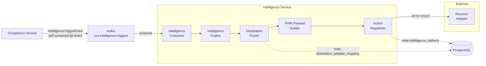

---

## 2. Trigger Processing Sequence

Detailed sequence diagram showing the interaction between components when processing an intelligence trigger. The trigger event is self-contained — no Compliance table lookups needed.

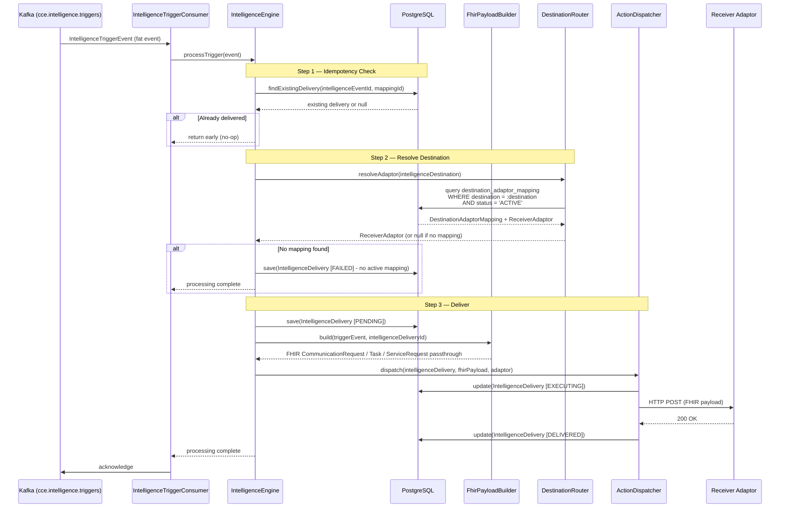

---

## 3. Destination Routing

How the Intelligence Service resolves which Receiver Adaptor should receive a delivery for a given intelligence destination. Each destination maps to exactly one adaptor (1:1 mapping).

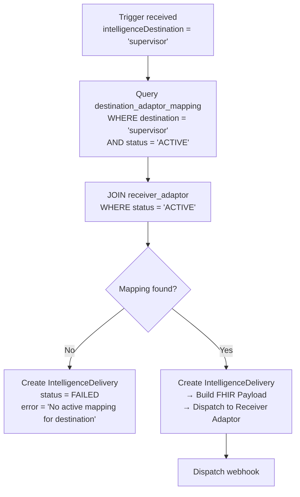

### Destination Routing Example

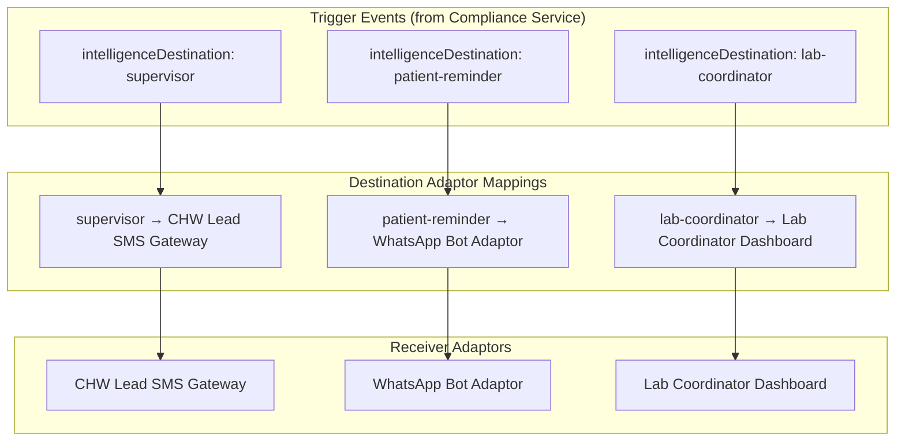

---

## 4. Action Dispatch & Webhook Delivery

How the Intelligence Service delivers an action to each subscribed Receiver Adaptor via webhook.

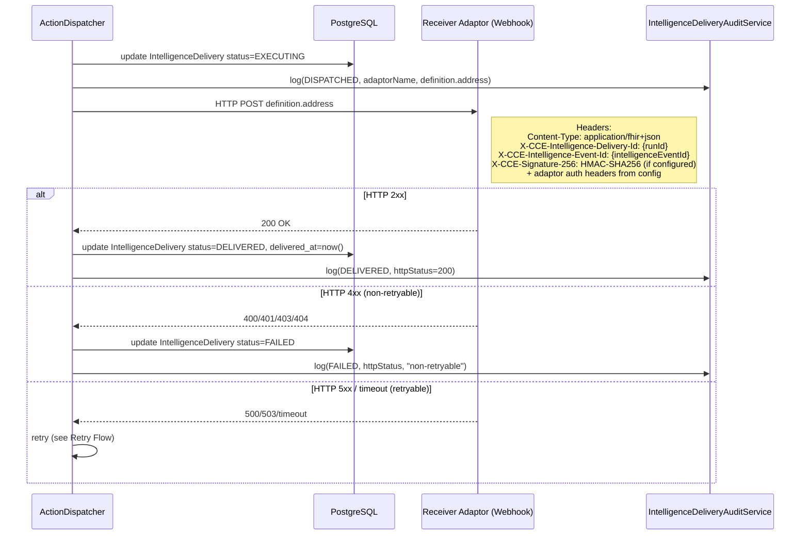

### Webhook Payload — FHIR Resource Generation

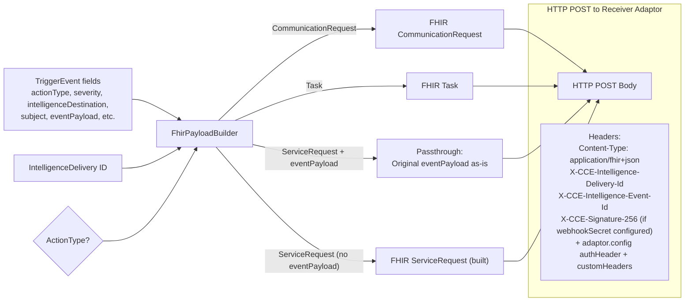

---

## 5. Intelligence Delivery Lifecycle

State machine for `intelligence_delivery.status` — all valid transitions.

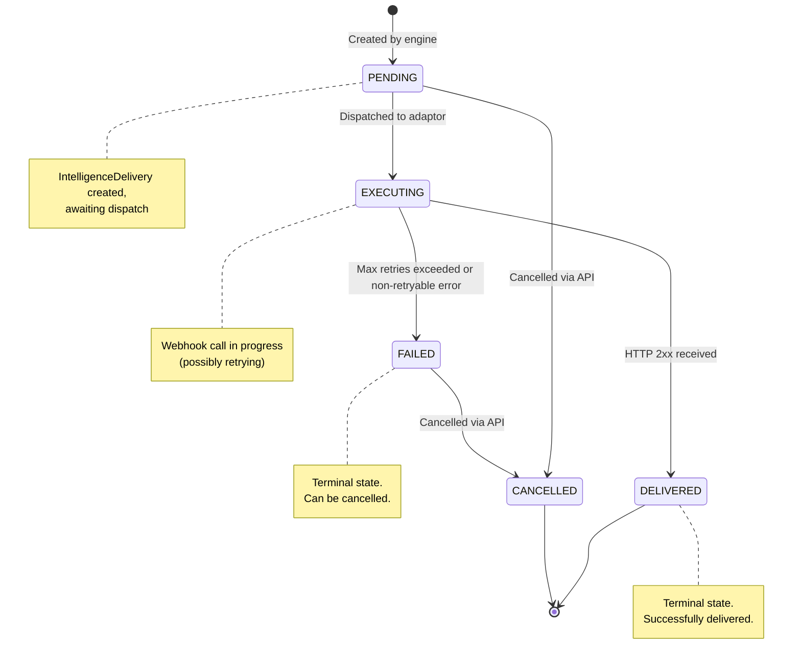

---

## 6. Retry & Error Handling

### 6.1 Webhook Delivery Retry

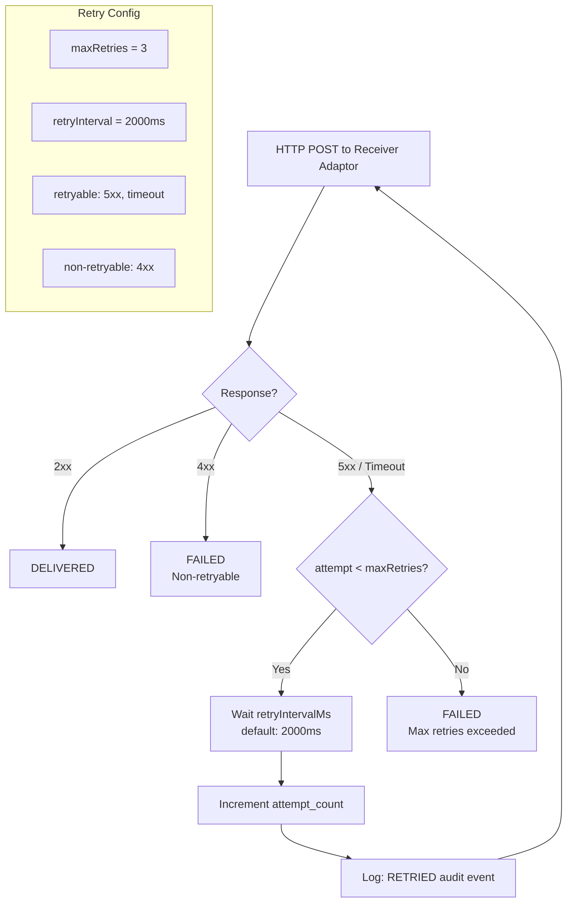

### 6.2 Kafka Consumer Error Handling

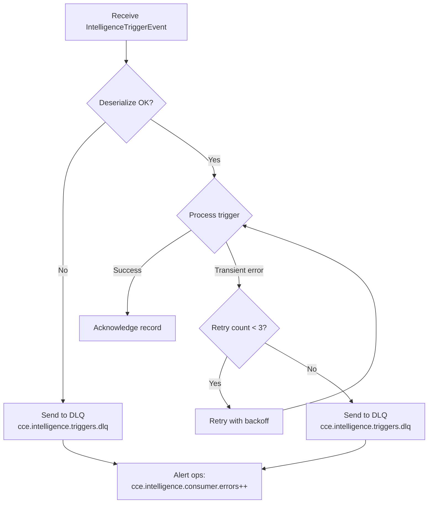

---

## 7. REST API Flows

### 7.1 Create Destination Adaptor Mapping

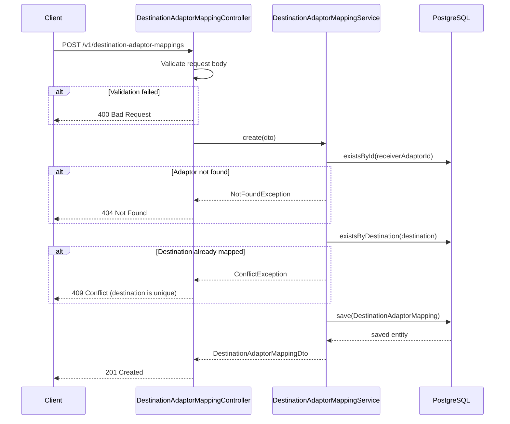

### 7.2 Cancel Intelligence Delivery

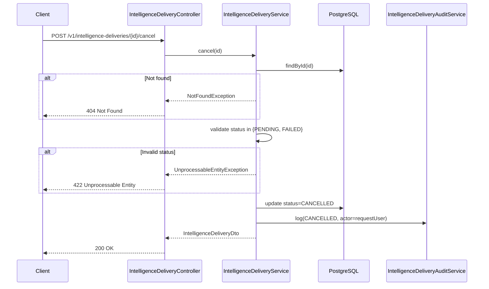

### 7.3 Delete Receiver Adaptor

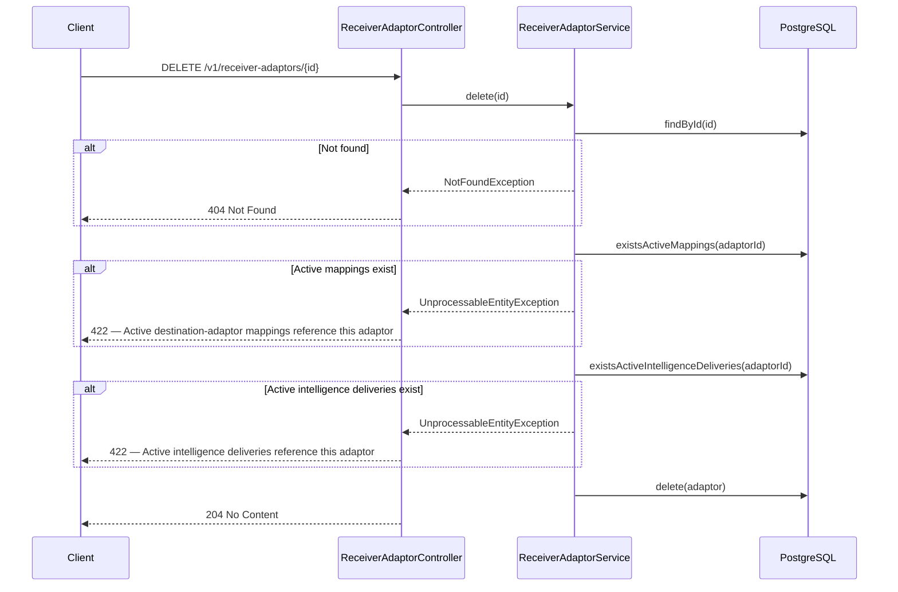
