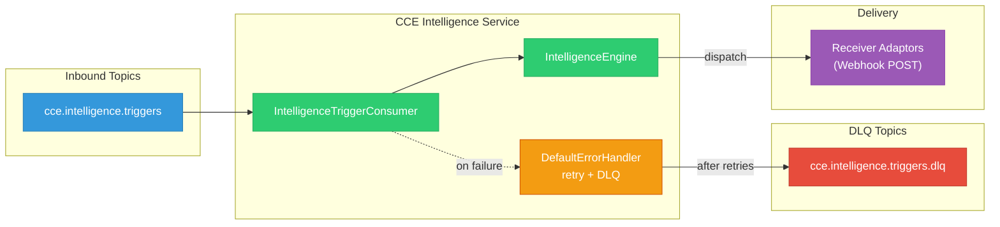
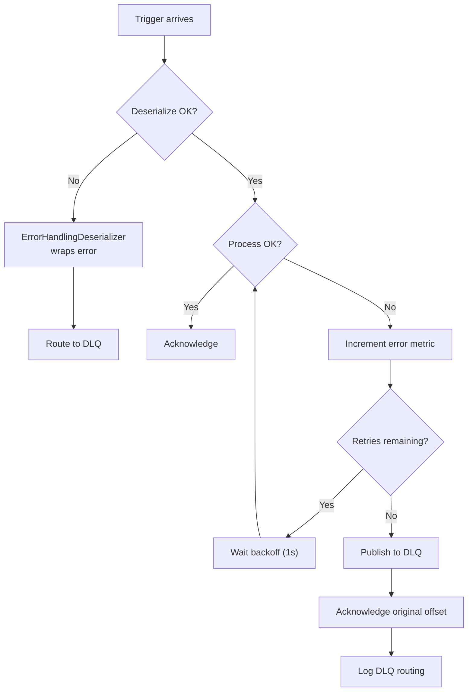

# Kafka & Event Architecture

## 1. Overview

The CCE Intelligence Service **consumes** intelligence triggers from the Compliance Service via Kafka. It does not produce to any Kafka topic — action delivery is via webhook HTTP POST to Receiver Adaptors.

> **Dependency: Compliance Service v1.0.0 does NOT yet publish intelligence triggers.** The `IntelligenceTriggerEvent` model exists in the Compliance Service codebase for schema documentation only. The Kafka producer for `cce.intelligence.triggers` is deferred to a future Compliance Service release, driven by PlanDefinition-level configuration. The Intelligence Service cannot receive triggers until this producer is active.



---

## 2. Topic Reference

| Topic | Direction | Partitions | Consumer Group | Description |
|---|---|---|---|---|
| `cce.intelligence.triggers` | Inbound | 25 | `cce-intelligence-service` | Deviation-driven triggers from Compliance Service |
| `cce.intelligence.triggers.dlq` | DLQ | 25 | — | Dead letter queue for failed trigger processing |

The `cce.intelligence.triggers` topic is declared as a `NewTopic` bean by the **Compliance Service**'s `KafkaConfig`. The Intelligence Service declares the DLQ topic.

---

## 3. Consumer Configuration

### 3.1 Common Settings

```yaml
spring.kafka:
  bootstrap-servers: ${KAFKA_BOOTSTRAP_SERVERS:localhost:9092}
  consumer:
    group-id: cce-intelligence-service
    auto-offset-reset: earliest
    enable-auto-commit: false
    properties:
      isolation.level: read_committed
      max.poll.records: 100
      max.poll.interval.ms: 300000
  listener:
    ack-mode: record
    concurrency: 3
```

| Setting | Value | Rationale |
|---|---|---|
| `auto-offset-reset` | `earliest` | Process all triggers from beginning on first join |
| `enable-auto-commit` | `false` | Framework-managed offset commits |
| `isolation.level` | `read_committed` | Only consume committed messages |
| `max.poll.records` | `100` | Batch size per poll |
| `ack-mode` | `RECORD` | Offset committed per record after successful processing |
| `concurrency` | `3` | 3 concurrent listener threads per instance |

### 3.2 Deserialization

```java
// Consumer factory uses ErrorHandlingDeserializer wrapping JsonDeserializer
ConsumerFactory<String, IntelligenceTriggerEvent>
  Key:   StringDeserializer
  Value: ErrorHandlingDeserializer → JsonDeserializer<IntelligenceTriggerEvent>

// Trusted packages
spring.json.trusted.packages: "org.openphc.cce.intelligence.*"
```

### 3.3 Retry & Dead Letter Queue

```yaml
cce.kafka:
  retry:
    max-attempts: 3
    backoff-interval-ms: 1000
```

Spring Kafka's `DefaultErrorHandler` is configured with `FixedBackOff` and `DeadLetterPublishingRecoverer`:

1. **Retry** — up to `max-attempts` with `backoff-interval-ms` between attempts
2. **DLQ** — after exhausting retries, publish to `cce.intelligence.triggers.dlq`
3. **Acknowledge** — original offset committed to move past the failed record

### 3.4 DLQ Topic Provisioning

```yaml
cce.kafka:
  topics:
    intelligence-triggers-dlq: cce.intelligence.triggers.dlq
    default-partitions: 25
```

---

## 4. Inbound Message Schema — IntelligenceTriggerEvent

Published by the Compliance Service when a deviation is detected (step transitions to OVERDUE or MISSED).

```json
{
  "id": "itrig-550e8400-e29b-41d4-a716-446655440099",
  "type": "cce.compliance.deviation.overdue",
  "subject": "260225-0002-5501",
  "protocolInstanceId": "660e8400-e29b-41d4-a716-446655440001",
  "stepInstanceId": "770e8400-e29b-41d4-a716-446655440002",
  "deviationId": "880e8400-e29b-41d4-a716-446655440005",
  "deviationType": "overdue",
  "stepState": "overdue",
  "actionId": "anc-visit-2",
  "protocolCanonical": "http://openphc.org/fhir/PlanDefinition/anc-high-risk|2.1",
  "facilityId": "0002",
  "detectedAt": "2026-03-25T00:00:05Z",
  "metadata": {
    "dueDate": "2026-03-20T00:00:00Z",
    "overdueDate": "2026-03-25T00:00:00Z"
  }
}
```

### Field Reference

| Field | Type | Required | Description |
|---|---|---|---|
| `id` | UUID | Yes | Unique trigger event identifier |
| `type` | String | Yes | `cce.compliance.deviation.overdue` or `cce.compliance.deviation.missed` |
| `subject` | String | Yes | Patient UPID (e.g., `260225-0002-5501`) |
| `protocolInstanceId` | UUID | Yes | Protocol instance that deviated |
| `stepInstanceId` | UUID | Yes | Step instance that deviated |
| `deviationId` | UUID | Yes | Deviation record ID (idempotency key) |
| `deviationType` | String | Yes | `overdue` or `missed` |
| `stepState` | String | Yes | Current step state (lowercase) |
| `actionId` | String | Yes | PlanDefinition action ID (e.g., `anc-visit-2`) |
| `protocolCanonical` | String | Yes | Protocol `url\|version` |
| `facilityId` | String | No | FOSA facility ID |
| `detectedAt` | OffsetDateTime | Yes | When the deviation was detected |
| `metadata` | Map | No | Additional context (dates, computed values) |

### Message Key

**Kafka Key:** `protocolInstanceId` — ensures all triggers for the same protocol instance go to the same partition, maintaining ordering.

### Trigger Types

| Type | Trigger Condition | Severity Default |
|---|---|---|
| `cce.compliance.deviation.overdue` | Step transitioned DUE → OVERDUE | Warning |
| `cce.compliance.deviation.missed` | Step transitioned OVERDUE → MISSED | Critical |

---

## 5. Sample Messages

### 5.1 Overdue Deviation Trigger

```json
{
  "id": "itrig-550e8400-e29b-41d4-a716-446655440099",
  "type": "cce.compliance.deviation.overdue",
  "subject": "260225-0002-5501",
  "protocolInstanceId": "660e8400-e29b-41d4-a716-446655440001",
  "stepInstanceId": "770e8400-e29b-41d4-a716-446655440002",
  "deviationId": "880e8400-e29b-41d4-a716-446655440005",
  "deviationType": "overdue",
  "stepState": "overdue",
  "actionId": "viral-load-check",
  "protocolCanonical": "http://openphc.org/fhir/PlanDefinition/hiv-treatment|1.0",
  "facilityId": "0002",
  "detectedAt": "2026-03-25T00:00:05Z",
  "metadata": {
    "dueDate": "2026-03-20T00:00:00Z",
    "overdueDate": "2026-03-25T00:00:00Z",
    "daysOverdue": 0
  }
}
```

### 5.2 Missed Step Trigger

```json
{
  "id": "itrig-660e8400-e29b-41d4-a716-446655440100",
  "type": "cce.compliance.deviation.missed",
  "subject": "260115-0001-7823",
  "protocolInstanceId": "770e8400-e29b-41d4-a716-446655440010",
  "stepInstanceId": "880e8400-e29b-41d4-a716-446655440020",
  "deviationId": "990e8400-e29b-41d4-a716-446655440030",
  "deviationType": "missed",
  "stepState": "missed",
  "actionId": "anc-visit-3",
  "protocolCanonical": "http://openphc.org/fhir/PlanDefinition/anc-high-risk|2.1",
  "facilityId": "0001",
  "detectedAt": "2026-04-01T00:00:05Z",
  "metadata": {
    "dueDate": "2026-03-15T00:00:00Z",
    "overdueDate": "2026-03-22T00:00:00Z",
    "missedDate": "2026-04-01T00:00:00Z",
    "daysPastMissedDate": 0
  }
}
```

---

## 6. Consumer Implementation

```java
@KafkaListener(topics = "${cce.kafka.topics.intelligence-triggers}")
public void consume(IntelligenceTriggerEvent trigger) {
    MDC.put("correlationId", trigger.getId());
    MDC.put("deviationId", trigger.getDeviationId().toString());
    MDC.put("subject", trigger.getSubject());
    MDC.put("deviationType", trigger.getDeviationType());
    try {
        intelligenceEngine.processTrigger(trigger);
    } catch (Exception e) {
        errorCounter.increment();  // cce.intelligence.consumer.errors
        throw e; // Propagate to DefaultErrorHandler for retry + DLQ
    } finally {
        MDC.clear();
    }
}
```

**Behavior on failure:** Exception propagates to `DefaultErrorHandler` → retries with backoff → routes to `cce.intelligence.triggers.dlq` after exhausting retries. Offset committed on success (`AckMode.RECORD`).

---

## 7. Ordering & Delivery Guarantees

| Guarantee | Mechanism |
|---|---|
| **At-least-once delivery** | `AckMode.RECORD` + `DefaultErrorHandler` + no auto-commit |
| **Idempotency (consumer)** | `(deviationId, intelligenceRuleId)` compound check before action creation |
| **Ordering (per partition)** | Key = `protocolInstanceId` ensures ordered triggers per protocol |
| **Transactional reads** | `isolation.level=read_committed` prevents reading uncommitted |

---

## 8. Error Recovery Flow


