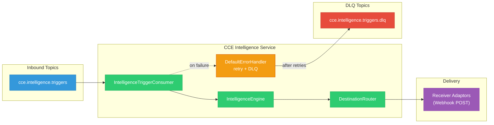
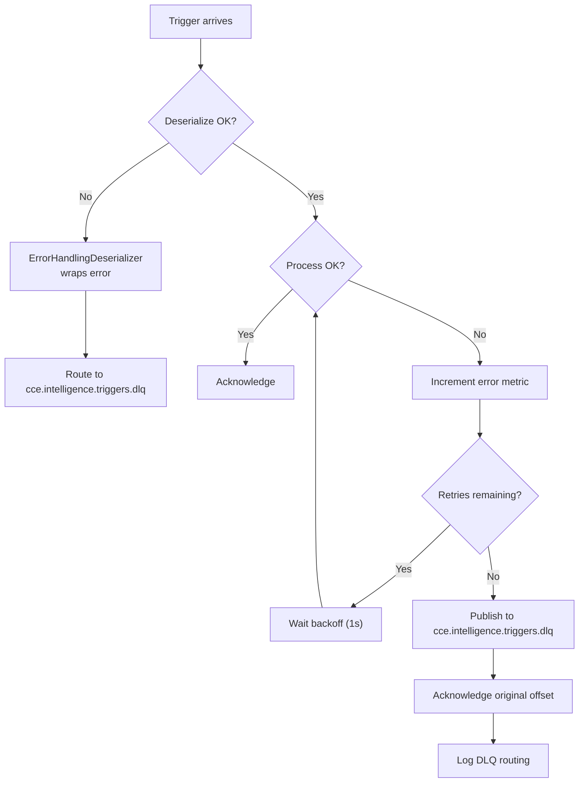

# Kafka & Event Architecture

## 1. Overview

The CCE Intelligence Service **consumes** intelligence triggers from the Compliance Service via Kafka. It does not produce to any Kafka topic — action delivery is via webhook HTTP POST to Receiver Adaptors.



---

## 2. Topic Reference

| Topic | Direction | Partitions | Consumer Group | Description |
|---|---|---|---|---|
| `cce.intelligence.triggers` | Inbound | 25 | `cce-intelligence-service` | Intelligence triggers from Compliance Service (deviation + completion events) |
| `cce.intelligence.triggers.dlq` | DLQ | 25 | — | Dead letter queue for failed trigger processing |

The `cce.intelligence.triggers` topic is declared as a `NewTopic` bean by the **Compliance Service**'s `KafkaConfig`. The Intelligence Service declares only the DLQ topic.

---

## 3. Consumer Configuration

### 3.1 Common Settings

```yaml
spring.kafka:
  bootstrap-servers: ${KAFKA_BOOTSTRAP_SERVERS:localhost:9092}
  consumer:
    group-id: cce-intelligence-service
    auto-offset-reset: earliest
    enable-auto-commit: false
    properties:
      isolation.level: read_committed
      max.poll.records: 100
      max.poll.interval.ms: 300000
  listener:
    ack-mode: record
    concurrency: 3
```

| Setting | Value | Rationale |
|---|---|---|
| `auto-offset-reset` | `earliest` | Process all triggers from beginning on first join |
| `enable-auto-commit` | `false` | Framework-managed offset commits |
| `isolation.level` | `read_committed` | Only consume committed messages |
| `max.poll.records` | `100` | Batch size per poll |
| `ack-mode` | `RECORD` | Offset committed per record after successful processing |
| `concurrency` | `3` | 3 concurrent listener threads per instance |

### 3.2 Deserialization

```java
// Consumer factory uses ErrorHandlingDeserializer wrapping JsonDeserializer
ConsumerFactory<String, IntelligenceTriggerEvent>
  Key:   StringDeserializer
  Value: ErrorHandlingDeserializer → JsonDeserializer<IntelligenceTriggerEvent>

// Trusted packages
spring.json.trusted.packages: "*"

// The Compliance Service serializes IntelligenceTriggerEvent from package
// org.openphc.cce.compliance.kafka.model — using wildcard (*) avoids
// deserialization failures when producer/consumer packages differ.
// The @KafkaListener's spring.json.value.default.type property ensures
// the correct target type regardless of type headers.
```

### 3.3 Retry & Dead Letter Queue

```yaml
cce.kafka:
  retry:
    max-attempts: 3
    backoff-interval-ms: 1000
```

Spring Kafka's `DefaultErrorHandler` is configured with `FixedBackOff` and `DeadLetterPublishingRecoverer`:

1. **Retry** — up to `max-attempts` with `backoff-interval-ms` between attempts
2. **DLQ** — after exhausting retries, publish to `cce.intelligence.triggers.dlq`
3. **Acknowledge** — original offset committed to move past the failed record

### 3.4 DLQ Topic Provisioning

```yaml
cce.kafka:
  topics:
    intelligence-triggers-dlq: cce.intelligence.triggers.dlq
    default-partitions: 25
```

---

## 4. Inbound Message Schema — IntelligenceTriggerEvent

Published by the Compliance Service (v1.1.0+) when an intelligence action's condition matches — triggered by a step's state change. The event is **self-contained** — the Compliance Service resolves all routing and payload metadata at publish time (action type, severity, intelligence destination, protocol definition), so the Intelligence Service requires **zero Compliance table reads** on the hot path.

### CloudEvents Envelope

The Compliance Service wraps `IntelligenceTriggerEvent` in a **CloudEvents v1.0** envelope. Kafka headers carry CloudEvents metadata as extension attributes:

| Kafka Header | CloudEvents Attribute | Example Value |
|---|---|---|
| `ce_specversion` | `specversion` | `1.0` |
| `ce_type` | `type` | `org.openphc.cce.intelligence.trigger.v1` |
| `ce_source` | `source` | `/cce-compliance-service` |
| `ce_id` | `id` | `550e8400-e29b-41d4-a716-446655440099` |
| `ce_time` | `time` | `2026-03-25T00:00:05Z` |
| `ce_correlationid` | (extension) | `corr-uuid` |
| `ce_actionid` | (extension) | `anc-visit-2` |
| `content-type` | `datacontenttype` | `application/json` |

The **Kafka record value** is the `IntelligenceTriggerEvent` JSON payload (the `data` portion of the CloudEvents envelope) — not the full CloudEvents JSON wrapper. Spring Kafka's `JsonDeserializer` with `spring.json.value.default.type` deserializes the value directly into `IntelligenceTriggerEvent`, ignoring CloudEvents headers. The `ErrorHandlingDeserializer` wraps deserialization failures gracefully.

> **Implementation note:** The consumer uses `spring.json.value.default.type=org.openphc.cce.intelligence.kafka.model.IntelligenceTriggerEvent` to force target type resolution, overriding any `__TypeId__` header from the producer. Combined with `spring.json.trusted.packages=*`, this ensures deserialization succeeds even though the Compliance producer serializes from `org.openphc.cce.compliance.kafka.model.IntelligenceTriggerEvent`.

### Event Payload

```json
{
  "id": "550e8400-e29b-41d4-a716-446655440099",
  "subject": "260225-0002-5501",
  "intelligenceEventId": "990e8400-e29b-41d4-a716-446655440010",
  "actionDefinitionId": "aad00001-0001-0001-0001-000000000001",
  "protocolDefinitionId": "ppd00001-0001-0001-0001-000000000001",
  "actionType": "CommunicationRequest",
  "severity": "HIGH",
  "intelligenceDestination": "supervisor",
  "stepState": "overdue",
  "actionId": "anc-visit-2",
  "protocolCanonical": "http://openphc.org/fhir/PlanDefinition/anc-high-risk|2.1",
  "detectedAt": "2026-03-25T00:00:05Z",
  "eventPayload": null
}
```

### Field Reference

| Field | Type | Required | Description |
|---|---|---|---|
| `id` | UUID | Yes | Unique trigger event identifier. Generated by the Compliance Service at publish time (UUID). |
| `subject` | String | Yes | Patient UPID (e.g., `260225-0002-5501`). |
| `intelligenceEventId` | UUID | Yes | Compliance Service's `intelligence_event_log.id` (primary key). Idempotency anchor for `intelligence_delivery`. |
| `actionDefinitionId` | UUID | Yes | FK to Compliance Service's `action_definition.id` — stored on `intelligence_delivery` for traceability. |
| `protocolDefinitionId` | UUID | Yes | FK to `protocol_definition.id` — stored on `intelligence_delivery` for traceability. Resolved by Compliance from the evaluator's runtime context (`intelligence_event_log.protocol_instance_id → protocol_instance.protocol_definition_id`). |
| `actionType` | String | Yes | FHIR `ActivityDefinition.kind` value: `CommunicationRequest`, `Task`, or `ServiceRequest`. Stored directly as the Intelligence Service `action_type` — no secondary mapping. |
| `severity` | String | Yes | Effective severity: `LOW`, `MEDIUM`, `HIGH`, `CRITICAL`. Resolved by Compliance from PlanDefinition extension `intelligence-severity`, falling back to `action_definition.severity`. |
| `intelligenceDestination` | String | Yes | Effective routing destination (e.g., `supervisor`, `patient-reminder`). Resolved by Compliance from PlanDefinition extension `intelligence-destination`, falling back to `action_definition.intelligence_destination`. Used for `destination_adaptor_mapping` routing lookup. |
| `stepState` | String | Yes | Current step state (lowercase): `due`, `overdue`, `missed`, `completed`. Used for trigger type derivation and FHIR extension. |
| `actionId` | String | Yes | PlanDefinition action ID (e.g., `anc-visit-2`). Stored on `intelligence_delivery` for traceability and FHIR payload. |
| `protocolCanonical` | String | Yes | Protocol `url\|version` |
| `detectedAt` | OffsetDateTime | Yes | When the event was detected |
| `eventPayload` | JsonNode | No | Original FHIR payload from the Compliance Service. When present **and** `actionType` is `ServiceRequest`, the `FhirPayloadBuilder` passes this through as-is to the Receiver Adaptor instead of constructing a synthetic FHIR resource. `null` for most trigger events (CommunicationRequest, Task). |

> **Design rationale (fat event):** By including `actionDefinitionId`, `protocolDefinitionId`, `actionType`, `severity`, and `intelligenceDestination` in the event, the Intelligence Service eliminates all Compliance table reads (`intelligence_event_log`, `action_definition`, `protocol_instance`, `protocol_definition`, `step_instance`) from the processing hot path. This is safe because ActivityDefinitions and PlanDefinitions are immutable once published — the values at trigger time are the correct values for the lifetime of the intelligence event.

### Message Key

**Kafka Key:** `intelligenceEventId` — ensures each trigger event is uniquely keyed. The Compliance Service uses `event.getIntelligenceEventId().toString()` as the Kafka record key.

### Trigger Type Derivation

| Derived Type | Condition | Trigger Scenario |
|---|---|---|
| `step.due` | `stepState == "due"` | Step transitioned PENDING → DUE |
| `deviation.overdue` | `stepState == "overdue"` | Step transitioned DUE → OVERDUE |
| `deviation.missed` | `stepState == "missed"` | Step transitioned OVERDUE → MISSED |
| `step.completed` | `stepState == "completed"` | Step completed (may be on-time or late — the PlanDefinition's action condition determines when this fires) |

```java
String triggerType = switch (event.getStepState()) {
    case "due"       -> "step.due";
    case "overdue"   -> "deviation.overdue";
    case "missed"    -> "deviation.missed";
    case "completed" -> "step.completed";
    default          -> "unknown";
};
```

Use this derived type for the `cce.intelligence.triggers.received` counter tag.

---

## 5. Sample Messages

### 5.1 Overdue Deviation Trigger

```json
{
  "id": "550e8400-e29b-41d4-a716-446655440099",
  "subject": "260225-0002-5501",
  "intelligenceEventId": "990e8400-e29b-41d4-a716-446655440010",
  "actionDefinitionId": "aad00001-0001-0001-0001-000000000001",
  "protocolDefinitionId": "ppd00001-0002-0002-0002-000000000002",
  "actionType": "CommunicationRequest",
  "severity": "MEDIUM",
  "intelligenceDestination": "supervisor",
  "stepState": "overdue",
  "actionId": "viral-load-check",
  "protocolCanonical": "http://openphc.org/fhir/PlanDefinition/hiv-treatment|1.0",
  "detectedAt": "2026-03-25T00:00:05Z"
}
```

### 5.2 Missed Deviation Trigger

```json
{
  "id": "550e8400-e29b-41d4-a716-446655440100",
  "subject": "260115-0001-7823",
  "intelligenceEventId": "990e8400-e29b-41d4-a716-446655440011",
  "actionDefinitionId": "aad00001-0001-0001-0001-000000000002",
  "protocolDefinitionId": "ppd00001-0001-0001-0001-000000000001",
  "actionType": "CommunicationRequest",
  "severity": "HIGH",
  "intelligenceDestination": "supervisor",
  "stepState": "missed",
  "actionId": "anc-visit-3",
  "protocolCanonical": "http://openphc.org/fhir/PlanDefinition/anc-high-risk|2.1",
  "detectedAt": "2026-04-01T00:00:05Z"
}
```

### 5.3 Completion Trigger

```json
{
  "id": "550e8400-e29b-41d4-a716-446655440101",
  "subject": "260225-0002-5501",
  "intelligenceEventId": "990e8400-e29b-41d4-a716-446655440012",
  "actionDefinitionId": "aad00001-0001-0001-0001-000000000001",
  "protocolDefinitionId": "ppd00001-0001-0001-0001-000000000001",
  "actionType": "CommunicationRequest",
  "severity": "LOW",
  "intelligenceDestination": "patient-reminder",
  "stepState": "completed",
  "actionId": "anc-visit-2",
  "protocolCanonical": "http://openphc.org/fhir/PlanDefinition/anc-high-risk|2.1",
  "detectedAt": "2026-04-02T10:30:00Z",
  "eventPayload": null
}
```

> **Note:** Completion triggers have `stepState: "completed"`. The trigger type `step.completed` is derived from `stepState == "completed"`. Whether this represents a late or on-time completion depends on the PlanDefinition's action condition — the Intelligence Service treats both the same. See [Trigger Type Derivation](#trigger-type-derivation).

### 5.4 ServiceRequest Trigger with Passthrough Payload

When the Compliance Service triggers a `ServiceRequest` action, it can include the original incoming FHIR payload in the `eventPayload` field. The Intelligence Service passes this through to the Receiver Adaptor as-is, without constructing a synthetic FHIR resource.

```json
{
  "id": "550e8400-e29b-41d4-a716-446655440102",
  "subject": "260225-0002-5501",
  "intelligenceEventId": "990e8400-e29b-41d4-a716-446655440013",
  "actionDefinitionId": "aad00001-0001-0001-0001-000000000003",
  "protocolDefinitionId": "ppd00001-0001-0001-0001-000000000001",
  "actionType": "ServiceRequest",
  "severity": "HIGH",
  "intelligenceDestination": "lab-coordinator",
  "stepState": "due",
  "actionId": "lab-referral-1",
  "protocolCanonical": "http://openphc.org/fhir/PlanDefinition/anc-high-risk|2.1",
  "detectedAt": "2026-04-03T08:00:00Z",
  "eventPayload": {
    "resourceType": "ServiceRequest",
    "status": "active",
    "intent": "order",
    "subject": { "identifier": { "system": "http://openphc.org/fhir/patient-upid", "value": "260225-0002-5501" } },
    "code": { "coding": [{ "system": "http://loinc.org", "code": "26453-1", "display": "CBC" }] }
  }
}
```

> **Passthrough behavior:** When `actionType` is `ServiceRequest` and `eventPayload` is not `null`, the `FhirPayloadBuilder` returns `eventPayload` directly — no synthetic resource is constructed. If `eventPayload` is `null`, a `ServiceRequest` resource is built by `FhirPayloadBuilder` as a fallback.

---

## 6. Consumer Implementation

### 6.1 IntelligenceTriggerConsumer

```java
@KafkaListener(
    topics = "${cce.kafka.topics.intelligence-triggers}",
    properties = {
        "spring.json.value.default.type=org.openphc.cce.intelligence.kafka.model.IntelligenceTriggerEvent"
    }
)
public void consume(IntelligenceTriggerEvent event) {
    MDC.put("correlationId", event.getId());
    MDC.put("subject", event.getSubject());
    MDC.put("intelligenceEventId", event.getIntelligenceEventId().toString());
    try {
        intelligenceEngine.processTrigger(event);
        String triggerType = deriveTriggerType(event);
        receivedCounter.increment(triggerType);
    } catch (Exception e) {
        errorCounter.increment();
        throw e; // Propagate to DefaultErrorHandler for retry + DLQ
    } finally {
        MDC.clear();
    }
}
```

**Behavior on failure:** Exception propagates to `DefaultErrorHandler` → retries with backoff → routes to `cce.intelligence.triggers.dlq` after exhausting retries. Offset is committed automatically on success (`AckMode.RECORD`).

---

## 7. Ordering & Delivery Guarantees

| Guarantee | Mechanism |
|---|---|
| **At-least-once delivery** | `AckMode.RECORD` + `DefaultErrorHandler` + no auto-commit |
| **Idempotency** | `(intelligenceEventId, destinationAdaptorMappingId)` uniqueness on `intelligence_delivery` |
| **Ordering (per partition)** | Key-based routing on `intelligenceEventId` ensures one trigger per key |
| **Transactional reads** | `isolation.level=read_committed` prevents reading uncommitted |

---

## 8. Error Recovery Flow


